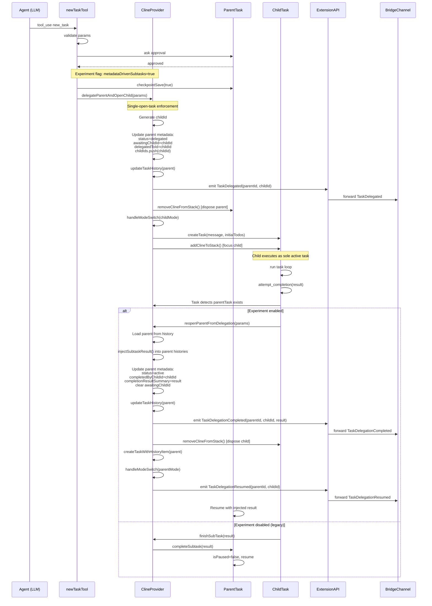

# Metadata-Driven Subtasks: Implementation Specification for rc2 Repository

## Executive Summary

This document provides a repository-specific implementation specification for refactoring task orchestration from watcher-based (pause-wait polling) to metadata-driven subtask delegation. It maps the high-level refactor plan to actual files, APIs, and patterns in this repository, producing an actionable blueprint for Phase 1 implementation.

---

## 1. File Mapping: Plan References → Actual Repository Locations

| Plan Reference                                    | Actual Location in rc2                                                                                     | Status          | Notes                                              |
| ------------------------------------------------- | ---------------------------------------------------------------------------------------------------------- | --------------- | -------------------------------------------------- |
| `src/core/webview/ClineProvider.ts`               | [`src/core/webview/ClineProvider.ts`](../../src/core/webview/ClineProvider.ts)                             | ✅ Exact match  | Provider orchestration, task stack management      |
| `src/core/task/Task.ts`                           | [`src/core/task/Task.ts`](../../src/core/task/Task.ts)                                                     | ✅ Exact match  | Task lifecycle, subtask methods at lines 1641-1706 |
| `src/core/tools/newTaskTool.ts`                   | [`src/core/tools/newTaskTool.ts`](../../src/core/tools/newTaskTool.ts)                                     | ✅ Exact match  | new_task tool implementation                       |
| `src/core/prompts/tools/attempt-completion.ts`    | [`src/core/tools/attemptCompletionTool.ts`](../../src/core/tools/attemptCompletionTool.ts)                 | ⚠️ Path differs | Renamed from prompts/tools to tools/               |
| `src/core/task-persistence/taskMetadata.ts`       | [`src/core/task-persistence/taskMetadata.ts`](../../src/core/task-persistence/taskMetadata.ts)             | ✅ Exact match  | HistoryItem generation at line 26                  |
| `src/core/task-persistence/apiMessages.ts`        | [`src/core/task-persistence/apiMessages.ts`](../../src/core/task-persistence/apiMessages.ts)               | ✅ Exact match  | API conversation persistence                       |
| `src/core/task-persistence/taskMessages.ts`       | [`src/core/task-persistence/taskMessages.ts`](../../src/core/task-persistence/taskMessages.ts)             | ✅ Exact match  | UI message persistence                             |
| `src/extension/api.ts`                            | [`src/extension/api.ts`](../../src/extension/api.ts)                                                       | ✅ Exact match  | IPC event broadcasting, StartNewTask at line 108   |
| `packages/cloud/src/bridge/ExtensionChannel.ts`   | [`packages/cloud/src/bridge/ExtensionChannel.ts`](../../packages/cloud/src/bridge/ExtensionChannel.ts)     | ✅ Exact match  | Extension-level bridge events, mapping at line 176 |
| `packages/cloud/src/bridge/TaskChannel.ts`        | [`packages/cloud/src/bridge/TaskChannel.ts`](../../packages/cloud/src/bridge/TaskChannel.ts)               | ✅ Exact match  | Task-level bridge events, mapping at line 45       |
| `packages/cloud/src/bridge/BridgeOrchestrator.ts` | [`packages/cloud/src/bridge/BridgeOrchestrator.ts`](../../packages/cloud/src/bridge/BridgeOrchestrator.ts) | ✅ Exact match  | Pending task issue at line 156 (TODO comment)      |
| `src/i18n/index.ts`                               | [`src/i18n/index.ts`](../../src/i18n/index.ts)                                                             | ✅ Exact match  | i18n system                                        |
| `src/i18n/locales/en/common.json`                 | [`src/i18n/locales/en/common.json`](../../src/i18n/locales/en/common.json)                                 | ✅ Exact match  | English strings                                    |
| `src/shared/experiments.ts`                       | [`src/shared/experiments.ts`](../../src/shared/experiments.ts)                                             | ✅ Exact match  | Experiment flags definition                        |
| `packages/types/src/events.ts`                    | [`packages/types/src/events.ts`](../../packages/types/src/events.ts)                                       | ✅ Exact match  | Event type definitions                             |
| `packages/types/src/task.ts`                      | [`packages/types/src/task.ts`](../../packages/types/src/task.ts)                                           | ✅ Exact match  | Task interfaces                                    |
| `packages/types/src/history.ts`                   | [`packages/types/src/history.ts`](../../packages/types/src/history.ts)                                     | ✅ Exact match  | HistoryItem type definition                        |
| `packages/types/src/cloud.ts`                     | [`packages/types/src/cloud.ts`](../../packages/types/src/cloud.ts)                                         | ✅ Exact match  | Bridge event schemas                               |
| `src/core/tools/__tests__/newTaskTool.spec.ts`    | [`src/core/tools/__tests__/newTaskTool.spec.ts`](../../src/core/tools/__tests__/newTaskTool.spec.ts)       | ✅ Exact match  | Unit tests for new_task                            |
| `src/__tests__/extension.spec.ts`                 | [`src/__tests__/extension.spec.ts`](../../src/__tests__/extension.spec.ts)                                 | ✅ Exact match  | Extension-level tests                              |

**Key Findings:**

- All core files exist at expected or near-expected locations
- One path divergence: attempt-completion tool moved from `prompts/tools/` to `tools/` directory
- Test infrastructure uses vitest with established patterns
- Type definitions are centralized in `packages/types/src/`

---

## 2. Event Model: New Events for Metadata-Driven Delegation

### 2.1 Event Definitions

Add three new events to replace TaskPaused/TaskUnpaused for metadata-driven flows:

```typescript
// Location: packages/types/src/events.ts (add to RooCodeEventName enum around line 28)

export enum RooCodeEventName {
	// ... existing events ...

	// Subtask Lifecycle (existing, keep for backward compat but deprecate for new flows)
	TaskPaused = "taskPaused",
	TaskUnpaused = "taskUnpaused",
	TaskSpawned = "taskSpawned",

	// NEW: Metadata-driven subtask lifecycle
	TaskDelegated = "taskDelegated", // Parent closed, delegated to child
	TaskDelegationCompleted = "taskDelegationCompleted", // Child completed, wrote back
	TaskDelegationResumed = "taskDelegationResumed", // Parent re-opened after child

	// ... rest of events ...
}
```

### 2.2 Event Payload Schemas

```typescript
// Location: packages/types/src/events.ts (add to rooCodeEventsSchema around line 75)

export const rooCodeEventsSchema = z.object({
	// ... existing schemas ...

	// NEW: Delegation event payloads
	[RooCodeEventName.TaskDelegated]: z.tuple([
		z.string(), // parentTaskId
		z.string(), // childTaskId
	]),

	[RooCodeEventName.TaskDelegationCompleted]: z.tuple([
		z.string(), // parentTaskId
		z.string(), // childTaskId
		z.string(), // completionResultSummary
	]),

	[RooCodeEventName.TaskDelegationResumed]: z.tuple([
		z.string(), // parentTaskId
		z.string(), // childTaskId
	]),

	// ... rest of schemas ...
})
```

### 2.3 TypeScript Event Type Extensions

```typescript
// Location: packages/types/src/task.ts (add to TaskProviderEvents around line 74)

export type TaskProviderEvents = {
	// ... existing events ...

	// NEW: Delegation events
	[RooCodeEventName.TaskDelegated]: [parentTaskId: string, childTaskId: string]
	[RooCodeEventName.TaskDelegationCompleted]: [parentTaskId: string, childTaskId: string, summary: string]
	[RooCodeEventName.TaskDelegationResumed]: [parentTaskId: string, childTaskId: string]

	// ... rest of events ...
}

// Add to TaskEvents interface around line 147
export type TaskEvents = {
	// ... existing events ...

	// NEW: Task-level delegation events
	[RooCodeEventName.TaskDelegated]: [childTaskId: string]
	[RooCodeEventName.TaskDelegationCompleted]: [childTaskId: string, summary: string]
	[RooCodeEventName.TaskDelegationResumed]: []

	// ... rest of events ...
}
```

### 2.4 Zod Schema for TaskEvent Discriminated Union

```typescript
// Location: packages/types/src/events.ts (add to taskEventSchema around line 171)

export const taskEventSchema = z.discriminatedUnion("eventName", [
	// ... existing event objects ...

	// NEW: Delegation events
	z.object({
		eventName: z.literal(RooCodeEventName.TaskDelegated),
		payload: rooCodeEventsSchema.shape[RooCodeEventName.TaskDelegated],
		taskId: z.number().optional(),
	}),
	z.object({
		eventName: z.literal(RooCodeEventName.TaskDelegationCompleted),
		payload: rooCodeEventsSchema.shape[RooCodeEventName.TaskDelegationCompleted],
		taskId: z.number().optional(),
	}),
	z.object({
		eventName: z.literal(RooCodeEventName.TaskDelegationResumed),
		payload: rooCodeEventsSchema.shape[RooCodeEventName.TaskDelegationResumed],
		taskId: z.number().optional(),
	}),
])
```

---

## 3. Metadata Schema Extensions

### 3.1 HistoryItem Schema Extensions

```typescript
// Location: packages/types/src/history.ts (extend historyItemSchema around line 7)

export const historyItemSchema = z.object({
	id: z.string(),
	rootTaskId: z.string().optional(),
	parentTaskId: z.string().optional(),
	number: z.number(),
	ts: z.number(),
	task: z.string(),
	tokensIn: z.number(),
	tokensOut: z.number(),
	cacheWrites: z.number().optional(),
	cacheReads: z.number().optional(),
	totalCost: z.number(),
	size: z.number().optional(),
	workspace: z.string().optional(),
	mode: z.string().optional(),

	// NEW: Delegation metadata
	status: z.enum(["active", "completed", "aborted", "delegated"]).optional(),
	delegatedToId: z.string().optional(), // Last child this parent delegated to
	childIds: z.array(z.string()).optional(), // All children spawned by this task
	awaitingChildId: z.string().optional(), // Child currently awaited (set when delegated)
	completedByChildId: z.string().optional(), // Child that completed and resumed this parent
	completionResultSummary: z.string().optional(), // Summary from completed child
})
```

### 3.2 Persistence Service Updates

**File: [`src/core/task-persistence/taskMetadata.ts`](../../src/core/task-persistence/taskMetadata.ts)**

Extend `TaskMetadataOptions` interface:

```typescript
// Around line 15
export type TaskMetadataOptions = {
	taskId: string
	rootTaskId?: string
	parentTaskId?: string
	taskNumber: number
	messages: ClineMessage[]
	globalStoragePath: string
	workspace: string
	mode?: string

	// NEW: Delegation metadata (optional, set by provider when delegating)
	status?: "active" | "completed" | "aborted" | "delegated"
	delegatedToId?: string
	childIds?: string[]
	awaitingChildId?: string
	completedByChildId?: string
	completionResultSummary?: string
}
```

Update `taskMetadata()` function to include new fields in returned `historyItem`:

```typescript
// Around line 87
const historyItem: HistoryItem = {
  id,
  rootTaskId,
  parentTaskId,
  number: taskNumber,
  ts: timestamp,
  task: hasMessages ? /* ... */ : /* ... */,
  tokensIn: tokenUsage.totalTokensIn,
  tokensOut: tokenUsage.totalTokensOut,
  cacheWrites: tokenUsage.totalCacheWrites,
  cacheReads: tokenUsage.totalCacheReads,
  totalCost: tokenUsage.totalCost,
  size: taskDirSize,
  workspace,
  mode,

  // NEW: Include delegation metadata if provided
  status,
  delegatedToId,
  childIds,
  awaitingChildId,
  completedByChildId,
  completionResultSummary,
}
```

### 3.3 Helper Functions for Subtask Result Injection

**New file: `src/core/task-persistence/subtaskResult.ts`**

```typescript
import { Anthropic } from "@anthropic-ai/sdk"
import type { ClineMessage } from "@roo-code/types"
import { ApiMessage, saveApiMessages } from "./apiMessages"
import { saveTaskMessages } from "./taskMessages"

/**
 * Inject a synthetic subtask_result message into parent's histories
 * This is called when a child task completes to write its result back to parent
 */
export async function injectSubtaskResult({
	parentTaskId,
	childTaskId,
	completionResult,
	globalStoragePath,
	parentClineMessages,
	parentApiMessages,
}: {
	parentTaskId: string
	childTaskId: string
	completionResult: string
	globalStoragePath: string
	parentClineMessages: ClineMessage[]
	parentApiMessages: ApiMessage[]
}): Promise<void> {
	const timestamp = Date.now()

	// UI message
	const uiMessage: ClineMessage = {
		ts: timestamp,
		type: "say",
		say: "subtask_result",
		text: completionResult,
	}

	// API message
	const apiMessage: ApiMessage = {
		role: "user",
		content: [
			{
				type: "text",
				text: `[new_task completed] Result: ${completionResult}`,
			},
		],
		ts: timestamp,
	}

	// Append to parent histories
	const updatedClineMessages = [...parentClineMessages, uiMessage]
	const updatedApiMessages = [...parentApiMessages, apiMessage]

	// Persist both
	await Promise.all([
		saveTaskMessages({
			messages: updatedClineMessages,
			taskId: parentTaskId,
			globalStoragePath,
		}),
		saveApiMessages({
			messages: updatedApiMessages,
			taskId: parentTaskId,
			globalStoragePath,
		}),
	])
}
```

---

## 4. Provider Orchestration APIs

### 4.1 `delegateParentAndOpenChild()` Method

**Location:** [`src/core/webview/ClineProvider.ts`](../../src/core/webview/ClineProvider.ts) (add new method around line 2650)

**Signature:**

```typescript
async delegateParentAndOpenChild(params: {
  parentTaskId: string,
  message: string,
  initialTodos: TodoItem[],
  mode: string,
}): Promise<Task>
```

**Atomic Steps:**

1. Get parent task from stack (must be current task)
2. Generate child task ID
3. Update parent metadata with delegation state:
    - `status = "delegated"`
    - `delegatedToId = childId`
    - `awaitingChildId = childId`
    - Push `childId` into `childIds[]` (dedupe if needed)
4. Persist parent metadata via `updateTaskHistory()`
5. Emit `TaskDelegated(parentId, childId)` event
6. Close parent instance via `removeClineFromStack()`
7. Create child as sole active task via `createTask(message, undefined, parentRef, { initialTodos })`
8. Switch provider mode to child's mode via `handleModeSwitch(mode)`
9. Focus child (automatic via `addClineToStack()`)

**Return:** Child task instance

### 4.2 `reopenParentFromDelegation()` Method

**Location:** [`src/core/webview/ClineProvider.ts`](../../src/core/webview/ClineProvider.ts) (add new method around line 2680)

**Signature:**

```typescript
async reopenParentFromDelegation(params: {
  parentTaskId: string,
  childTaskId: string,
  completionResultSummary: string,
}): Promise<void>
```

**Atomic Steps:**

1. Get parent HistoryItem from `getTaskWithId(parentTaskId)`
2. Load parent's current messages from disk
3. Inject synthetic subtask_result using new helper:
    ```typescript
    await injectSubtaskResult({
    	parentTaskId,
    	childTaskId,
    	completionResult: completionResultSummary,
    	globalStoragePath: this.globalStoragePath,
    	parentClineMessages,
    	parentApiMessages,
    })
    ```
4. Update parent metadata:
    - `status = "active"`
    - `completedByChildId = childTaskId`
    - `completionResultSummary = completionResultSummary`
    - Clear `awaitingChildId`
    - Ensure `childTaskId ∈ childIds[]`
5. Persist updated metadata via `updateTaskHistory()`
6. Emit `TaskDelegationCompleted(parentId, childId, summary)` event
7. Close child instance (if still open) via `removeClineFromStack()`
8. Re-open parent from history via `createTaskWithHistoryItem(updatedHistoryItem)`
9. Restore parent's saved mode via `handleModeSwitch(parentMode)`
10. Emit `TaskDelegationResumed(parentId, childId)` event
11. Focus parent (automatic)

**Return:** void (parent becomes active)

---

## 5. Attempt Completion Integration

### 5.1 Hook Location

**File:** [`src/core/tools/attemptCompletionTool.ts`](../../src/core/tools/attemptCompletionTool.ts)  
**Lines:** 98-108 (current subtask completion logic)

### 5.2 Current Behavior (to be replaced)

```typescript
// Current code at line 98
if (cline.parentTask) {
	const didApprove = await askFinishSubTaskApproval()

	if (!didApprove) {
		return
	}

	// tell the provider to remove the current subtask and resume the previous task in the stack
	await cline.providerRef.deref()?.finishSubTask(result)
	return
}
```

### 5.3 New Behavior (metadata-driven)

```typescript
// NEW behavior (behind experiment flag)
if (cline.parentTask) {
	const didApprove = await askFinishSubTaskApproval()

	if (!didApprove) {
		return
	}

	const provider = cline.providerRef.deref()
	if (!provider) {
		throw new Error("Provider reference lost")
	}

	// Check experiment flag
	const state = await provider.getState()
	const useMetadataSubtasks = experiments.isEnabled(state.experiments ?? {}, EXPERIMENT_IDS.METADATA_DRIVEN_SUBTASKS)

	if (useMetadataSubtasks) {
		// NEW: Metadata-driven delegation flow
		await provider.reopenParentFromDelegation({
			parentTaskId: cline.parentTask.taskId,
			childTaskId: cline.taskId,
			completionResultSummary: result,
		})
	} else {
		// LEGACY: Watcher-based flow (existing code)
		await provider.finishSubTask(result)
	}

	return
}
```

---

## 6. Single-Open-Task Invariant Enforcement

All task creation entry points must enforce single-open-task by closing current task first.

### 6.1 Entry Points to Modify

| Entry Point         | File                                                                                   | Line | Required Change                                        |
| ------------------- | -------------------------------------------------------------------------------------- | ---- | ------------------------------------------------------ |
| User-initiated task | [`ClineProvider.createTask()`](../../src/core/webview/ClineProvider.ts)                | 2570 | Add guard: if not subtask, close current first         |
| History resume      | [`ClineProvider.createTaskWithHistoryItem()`](../../src/core/webview/ClineProvider.ts) | 860  | Already calls `removeClineFromStack()` at line 866 ✅  |
| Subtask spawn       | [`Task.startSubtask()`](../../src/core/task/Task.ts)                                   | 1641 | Replace pause-wait with `delegateParentAndOpenChild()` |
| IPC StartNewTask    | [`API.startNewTask()`](../../src/extension/api.ts)                                     | 108  | Already calls `removeClineFromStack()` at line 133 ✅  |

### 6.2 Implementation for `createTask()`

```typescript
// Location: src/core/webview/ClineProvider.ts around line 2570

public async createTask(
  text?: string,
  images?: string[],
  parentTask?: Task,
  options: CreateTaskOptions = {},
  configuration: RooCodeSettings = {},
): Promise<Task> {
  // ... existing configuration setup ...

  // NEW: Enforce single-open-task invariant
  // Only close current task if this is NOT a subtask creation
  if (!parentTask) {
    // Check experiment flag
    const state = await this.getState()
    const useMetadataSubtasks = experiments.isEnabled(
      state.experiments ?? {},
      EXPERIMENT_IDS.METADATA_DRIVEN_SUBTASKS
    )

    if (useMetadataSubtasks && this.clineStack.length > 0) {
      await this.removeClineFromStack()
    }
  }

  // ... rest of existing task creation logic ...
}
```

### 6.3 Implementation for `startSubtask()`

```typescript
// Location: src/core/task/Task.ts around line 1641

public async startSubtask(message: string, initialTodos: TodoItem[], mode: string) {
  const provider = this.providerRef.deref()

  if (!provider) {
    throw new Error("Provider not available")
  }

  // Check experiment flag
  const state = await provider.getState()
  const useMetadataSubtasks = experiments.isEnabled(
    state.experiments ?? {},
    EXPERIMENT_IDS.METADATA_DRIVEN_SUBTASKS
  )

  if (useMetadataSubtasks) {
    // NEW: Metadata-driven delegation
    return await provider.delegateParentAndOpenChild({
      parentTaskId: this.taskId,
      message,
      initialTodos,
      mode,
    })
  } else {
    // LEGACY: Existing pause-wait flow
    const newTask = await provider.createTask(message, undefined, this, { initialTodos })

    if (newTask) {
      this.isPaused = true
      this.childTaskId = newTask.taskId

      await provider.handleModeSwitch(mode)
      await delay(500)

      this.emit(RooCodeEventName.TaskPaused, this.taskId)
      this.emit(RooCodeEventName.TaskSpawned, newTask.taskId)
    }

    return newTask
  }
}
```

---

## 7. Experiment Flag Definition

### 7.1 Add to EXPERIMENT_IDS

**File:** [`src/shared/experiments.ts`](../../src/shared/experiments.ts)  
**Location:** Line 3 (add to EXPERIMENT_IDS object)

```typescript
export const EXPERIMENT_IDS = {
	MULTI_FILE_APPLY_DIFF: "multiFileApplyDiff",
	POWER_STEERING: "powerSteering",
	PREVENT_FOCUS_DISRUPTION: "preventFocusDisruption",
	IMAGE_GENERATION: "imageGeneration",
	RUN_SLASH_COMMAND: "runSlashCommand",

	// NEW: Metadata-driven subtasks
	METADATA_DRIVEN_SUBTASKS: "metadataDrivenSubtasks",
} as const satisfies Record<string, ExperimentId>
```

### 7.2 Add to experimentConfigsMap

**Location:** Line 19 (experimentConfigsMap)

```typescript
export const experimentConfigsMap: Record<ExperimentKey, ExperimentConfig> = {
	MULTI_FILE_APPLY_DIFF: { enabled: false },
	POWER_STEERING: { enabled: false },
	PREVENT_FOCUS_DISRUPTION: { enabled: false },
	IMAGE_GENERATION: { enabled: false },
	RUN_SLASH_COMMAND: { enabled: false },

	// NEW: Default to disabled for initial rollout
	METADATA_DRIVEN_SUBTASKS: { enabled: false },
}
```

### 7.3 Gating Points

All locations where behavior diverges based on flag:

1. **Task.startSubtask()** - Choose delegation vs pause-wait (line 1641)
2. **attemptCompletionTool()** - Choose reopenParent vs finishSubTask (line 98)
3. **ClineProvider.createTask()** - Enforce single-open invariant (line 2570)
4. **newTaskTool validation** - Skip checkpoint save if metadata-driven? (line 119, TBD)

---

## 8. IPC and Bridge Event Propagation

### 8.1 Extension API Event Forwarding

**File:** [`src/extension/api.ts`](../../src/extension/api.ts)  
**Method:** `registerListeners()` at line 204

Add new event listeners:

```typescript
// Around line 267 (after TaskSpawned listener)

task.on(RooCodeEventName.TaskDelegated, (childTaskId) => {
	this.emit(RooCodeEventName.TaskDelegated, task.taskId, childTaskId)
})

task.on(RooCodeEventName.TaskDelegationCompleted, (childTaskId, summary) => {
	this.emit(RooCodeEventName.TaskDelegationCompleted, task.taskId, childTaskId, summary)
})

task.on(RooCodeEventName.TaskDelegationResumed, () => {
	this.emit(RooCodeEventName.TaskDelegationResumed, task.taskId, task.childTaskId || "")
})
```

### 8.2 Bridge ExtensionChannel Mapping

**File:** [`packages/cloud/src/bridge/ExtensionChannel.ts`](../../packages/cloud/src/bridge/ExtensionChannel.ts)  
**Method:** `setupListeners()` at line 176

Add to eventMapping array:

```typescript
// Around line 190 (after TaskSpawned mapping)

const eventMapping = [
	// ... existing mappings ...
	{ from: RooCodeEventName.TaskSpawned, to: ExtensionBridgeEventName.TaskSpawned },

	// NEW: Delegation event mappings
	{ from: RooCodeEventName.TaskDelegated, to: ExtensionBridgeEventName.TaskDelegated },
	{ from: RooCodeEventName.TaskDelegationCompleted, to: ExtensionBridgeEventName.TaskDelegationCompleted },
	{ from: RooCodeEventName.TaskDelegationResumed, to: ExtensionBridgeEventName.TaskDelegationResumed },

	// ... rest of mappings ...
] as const
```

### 8.3 Bridge Event Schemas

**File:** [`packages/types/src/cloud.ts`](../../packages/types/src/cloud.ts)  
**Location:** ExtensionBridgeEventName enum at line 423, schema at line 515

Add enum values:

```typescript
// Around line 437
export enum ExtensionBridgeEventName {
	// ... existing ...
	TaskSpawned = RooCodeEventName.TaskSpawned,

	// NEW
	TaskDelegated = RooCodeEventName.TaskDelegated,
	TaskDelegationCompleted = RooCodeEventName.TaskDelegationCompleted,
	TaskDelegationResumed = RooCodeEventName.TaskDelegationResumed,

	// ... rest ...
}
```

Add schemas:

```typescript
// Around line 517 (after TaskSpawned schema)

z.object({
  type: z.literal(ExtensionBridgeEventName.TaskDelegated),
  instance: extensionInstanceSchema,
  timestamp: z.number(),
}),
z.object({
  type: z.literal(ExtensionBridgeEventName.TaskDelegationCompleted),
  instance: extensionInstanceSchema,
  timestamp: z.number(),
}),
z.object({
  type: z.literal(ExtensionBridgeEventName.TaskDelegationResumed),
  instance: extensionInstanceSchema,
  timestamp: z.number(),
}),
```

### 8.4 TaskChannel Event Support

**File:** [`packages/cloud/src/bridge/TaskChannel.ts`](../../packages/cloud/src/bridge/TaskChannel.ts)

**Analysis:** Delegation events are provider-level, not task-level. TaskChannel already supports `Message`, `TaskModeSwitched`, and `TaskInteractive` at line 45. No changes needed for TaskChannel unless task-specific routing is desired later.

---

## 9. Minimal UI and i18n Updates

### 9.1 String Keys for Delegation States

**File:** [`src/i18n/locales/en/common.json`](../../src/i18n/locales/en/common.json)  
**Location:** Add new section around line 168

```json
{
	"tasks": {
		"canceled": "Task error: It was stopped and canceled by the user.",
		"deleted": "Task failure: It was stopped and deleted by the user.",
		"incomplete": "Task #{{taskNumber}} (Incomplete)",
		"no_messages": "Task #{{taskNumber}} (No messages)",

		"delegated": "Delegated to subtask",
		"delegated_to": "Delegated to task {{childId}}",
		"delegation_completed": "Subtask completed, resuming parent",
		"awaiting_child": "Awaiting child task {{childId}}"
	}
}
```

### 9.2 UI State Updates (Conceptual)

**Note:** Actual webview changes are out of scope for this spec, but here's the conceptual model:

**History List Display:**

- Task with `status: "delegated"` shows badge: "Delegated"
- Link to child task via `delegatedToId` or `awaitingChildId`
- After child completes, parent shows `completionResultSummary` in preview

**Active Task View:**

- No "paused" indicators (removed)
- On delegation, child becomes focused immediately
- On completion, parent becomes focused with injected result

---

## 10. Testing Strategy

### 10.1 Unit Test Requirements

**File:** [`src/core/tools/__tests__/newTaskTool.spec.ts`](../../src/core/tools/__tests__/newTaskTool.spec.ts)

Add new test cases (around line 630):

```typescript
describe("metadata-driven subtasks (experiment enabled)", () => {
	beforeEach(() => {
		// Enable experiment flag
		mockCline.providerRef.deref.mockReturnValue({
			getState: vi.fn(() => ({
				customModes: [],
				mode: "ask",
				experiments: { metadataDrivenSubtasks: true },
			})),
			delegateParentAndOpenChild: vi.fn().mockResolvedValue({
				taskId: "child-task-id",
			}),
		})
	})

	it("should call delegateParentAndOpenChild instead of startSubtask", async () => {
		const block: ToolUse = {
			type: "tool_use",
			name: "new_task",
			params: {
				mode: "code",
				message: "Do something",
				todos: "[ ] Task 1",
			},
			partial: false,
		}

		await newTaskTool(/* ... */)

		// Should call new delegation method
		expect(mockProvider.delegateParentAndOpenChild).toHaveBeenCalledWith({
			parentTaskId: mockCline.taskId,
			message: "Do something",
			initialTodos: expect.any(Array),
			mode: "code",
		})

		// Should NOT set pause state
		expect(mockCline.isPaused).toBe(false)
		expect(mockCline.childTaskId).toBeUndefined()

		// Should NOT call waitForSubtask
		expect(mockCline.waitForSubtask).not.toHaveBeenCalled()
	})

	it("should persist parent delegation metadata", async () => {
		// Verify metadata fields are set:
		// - status=delegated
		// - awaitingChildId=childId
		// - delegatedToId=childId
		// - childId pushed to childIds[]
	})

	it("should emit TaskDelegated event", async () => {
		// Verify event emission with parentId, childId
	})
})

describe("child completion write-back (experiment enabled)", () => {
	it("should re-open parent with injected result", async () => {
		// Mock parent task in history with status=delegated
		// Call reopenParentFromDelegation
		// Verify parent is re-opened as active
		// Verify completedByChildId, completionResultSummary set
		// Verify awaitingChildId cleared
		// Verify subtask_result message added to histories
	})

	it("should emit TaskDelegationCompleted and TaskDelegationResumed events", async () => {
		// Verify event sequence
	})
})
```

### 10.2 Test Execution Pattern

Per repository rules, tests must be run from correct workspace:

```bash
# From project root
cd src && npx vitest run core/tools/__tests__/newTaskTool.spec.ts

# NOT from root (causes "command not found" error):
# npx vitest run src/core/tools/__tests__/newTaskTool.spec.ts  # ❌ WRONG
```

### 10.3 Integration Test Considerations

**File:** `apps/vscode-e2e/src/suite/subtasks.test.ts` (existing e2e tests)

Update or add tests to verify:

- Single-open-task invariant maintained across all entry points
- Delegation metadata persists correctly
- Parent re-opens focused after child completion
- No orphaned tasks after rapid operations

---

## 11. Phase 1 Implementation Plan

**Goal:** Implement schema + events + IPC/Bridge propagation behind `experiments.metadataDrivenSubtasks` flag.

### Phase 1 Tasks for Code Mode

```markdown
[ ] 1. Add experiment flag to experiments.ts - Add METADATA_DRIVEN_SUBTASKS to EXPERIMENT_IDS - Add to experimentConfigsMap with enabled: false - Update type assertions

[ ] 2. Extend HistoryItem type in packages/types/src/history.ts - Add status, delegatedToId, childIds, awaitingChildId, completedByChildId, completionResultSummary - Update historyItemSchema with new optional fields

[ ] 3. Add new event types to packages/types/src/events.ts - Add TaskDelegated, TaskDelegationCompleted, TaskDelegationResumed to RooCodeEventName enum - Add event payload schemas to rooCodeEventsSchema - Add to taskEventSchema discriminated union - Update RooCodeEvents type - Update TaskEvents type

[ ] 4. Update TaskProviderEvents in packages/types/src/task.ts - Add delegation event signatures to TaskProviderEvents type - Add delegation event signatures to TaskEvents type

[ ] 5. Add Bridge event types to packages/types/src/cloud.ts - Add to ExtensionBridgeEventName enum - Add schemas to extensionBridgeEventSchema discriminated union

[ ] 6. Create subtask result injection helper - Create new file src/core/task-persistence/subtaskResult.ts - Implement injectSubtaskResult() function - Export from src/core/task-persistence/index.ts

[ ] 7. Extend taskMetadata() in src/core/task-persistence/taskMetadata.ts - Add delegation fields to TaskMetadataOptions interface - Include new fields in historyItem creation - Preserve backward compatibility (all new fields optional)

[ ] 8. Add delegateParentAndOpenChild() to ClineProvider - Location: src/core/webview/ClineProvider.ts around line 2650 - Implement atomic delegation sequence per spec section 4.1 - Emit TaskDelegated event - Test invariant: exactly one task open after call

[ ] 9. Add reopenParentFromDelegation() to ClineProvider - Location: src/core/webview/ClineProvider.ts around line 2680 - Implement re-open sequence per spec section 4.2 - Use injectSubtaskResult() helper - Emit TaskDelegationCompleted and TaskDelegationResumed events - Test invariant: exactly one task open after call

[ ] 10. Update Task.startSubtask() with experiment gating - Location: src/core/task/Task.ts line 1641 - Add experiment flag check - Route to delegateParentAndOpenChild() when enabled - Preserve existing pause-wait flow when disabled

[ ] 11. Update attemptCompletionTool with experiment gating - Location: src/core/tools/attemptCompletionTool.ts line 98 - Add experiment flag check in subtask completion branch - Route to reopenParentFromDelegation() when enabled - Preserve existing finishSubTask() flow when disabled

[ ] 12. Register delegation event listeners in ClineProvider - Location: src/core/webview/ClineProvider.ts around line 258 - Add TaskDelegated, TaskDelegationCompleted, TaskDelegationResumed listeners - Forward to provider-level emit - Store cleanup functions in taskEventListeners

[ ] 13. Forward delegation events in Extension API - Location: src/extension/api.ts around line 267 - Add task-level listeners for new events - Emit to IPC broadcast

[ ] 14. Add delegation events to Bridge ExtensionChannel - Location: packages/cloud/src/bridge/ExtensionChannel.ts line 176 - Add to eventMapping array - Ensure proper cleanup in cleanupListeners()

[ ] 15. Add i18n strings for delegation states - Location: src/i18n/locales/en/common.json around line 168 - Add delegated, delegated_to, delegation_completed, awaiting_child strings - Replicate to other locale files (de, es, fr, etc.)

[ ] 16. Write unit tests for delegation flow - File: src/core/tools/**tests**/newTaskTool.spec.ts - Add describe block for metadata-driven subtasks - Test delegateParentAndOpenChild() called when flag enabled - Test metadata fields set correctly - Test events emitted - Test no calls to waitForSubtask()

[ ] 17. Write unit tests for completion write-back - File: src/core/tools/**tests**/attemptCompletionTool.spec.ts - Test reopenParentFromDelegation() called when flag enabled - Test parent metadata updated - Test subtask_result injected - Test events emitted in correct sequence

[ ] 18. Add integration test for single-open-task invariant - File: apps/vscode-e2e/src/suite/subtasks.test.ts (or new file) - Test rapid task creation maintains invariant - Test delegation flow end-to-end - Test history resume of delegated parent

[ ] 19. Run all tests and verify no regressions - cd src && npx vitest run core/tools/**tests**/newTaskTool.spec.ts - cd src && npx vitest run core/tools/**tests**/attemptCompletionTool.spec.ts - Verify existing subtask tests still pass - Verify no flaky behavior

[ ] 20. Document experiment flag in user-facing docs - Update relevant markdown docs if needed - Add inline code comments explaining flag purpose
```

---

## 12. Risk Mitigation and Validation Checklist

### 12.1 Backward Compatibility

- [ ] Experiment flag defaults to `false` (legacy behavior)
- [ ] Existing pause-wait flow remains untouched when flag disabled
- [ ] Historical tasks with paused state continue to work
- [ ] No breaking changes to public APIs

### 12.2 Data Integrity

- [ ] Parent metadata persisted before disposal
- [ ] Child result injection is atomic (both UI and API histories updated together)
- [ ] All new HistoryItem fields are optional (backward compatible)
- [ ] No data loss if parent/child relationship breaks during crash

### 12.3 Event System

- [ ] All new events properly typed in TypeScript and Zod
- [ ] IPC broadcast includes new events
- [ ] Bridge channels forward new events
- [ ] Telemetry can handle new event types (or explicitly filter if needed)

### 12.4 Single-Open-Task Invariant

- [ ] Verified at all entry points: createTask, createTaskWithHistoryItem, startSubtask, IPC StartNewTask
- [ ] Race conditions prevented (existing `removeClineFromStack` is atomic)
- [ ] Stack never contains > 1 task after delegation
- [ ] Child completion always closes child before opening parent

### 12.5 Testing Coverage

- [ ] Unit tests for both flag ON and flag OFF paths
- [ ] Integration tests for delegation flow
- [ ] Tests verify metadata schema changes
- [ ] Tests verify event emission sequence
- [ ] No flaky tests due to timing issues

---

## 13. Open Questions and Design Decisions

### 13.1 Checkpoint Save on Delegation

**Question:** Should we still save a checkpoint before delegating the parent?

**Current behavior:** [`newTaskTool.ts:119`](../../src/core/tools/newTaskTool.ts:119) saves checkpoint before pause.

**Recommendation:** Keep checkpoint save before delegation for consistency. The checkpoint captures parent's file state before child makes changes, enabling restore if needed.

### 13.2 Mode Switch Timing

**Question:** When should mode switch occur - before or after parent closure?

**Current behavior:** Mode switches after child creation, before parent resumes ([`Task.ts:1654`](../../src/core/task/Task.ts:1654))

**Recommendation:** Switch mode after parent closure, before child creation. Sequence:

1. Close parent
2. Switch to child's mode
3. Create child
4. Focus child

### 13.3 skipPrevResponseIdOnce Flag

**Question:** Should parent's `skipPrevResponseIdOnce` be set when injecting subtask result?

**Current behavior:** [`Task.completeSubtask():1698`](../../src/core/task/Task.ts:1698) sets `this.skipPrevResponseIdOnce = true`

**Recommendation:** Yes, set it when injecting. The parent's next API call should include the full conversation with injected result, not skip backwards.

---

## 14. Implementation Dependencies

### 14.1 Type System Updates (Foundation)

Must be completed first as other changes depend on these types:

1. `packages/types/src/events.ts` - Event type definitions
2. `packages/types/src/history.ts` - HistoryItem schema
3. `packages/types/src/task.ts` - TaskEvents, TaskProviderEvents
4. `packages/types/src/cloud.ts` - Bridge event schemas

### 14.2 Persistence Layer (Core)

Second layer, depends on types:

1. `src/core/task-persistence/taskMetadata.ts` - Metadata generation with new fields
2. `src/core/task-persistence/subtaskResult.ts` - New helper for result injection

### 14.3 Orchestration Layer (Provider Methods)

Third layer, depends on persistence:

1. `src/core/webview/ClineProvider.ts` - delegateParentAndOpenChild(), reopenParentFromDelegation()
2. `src/core/task/Task.ts` - Gated startSubtask()
3. `src/core/tools/attemptCompletionTool.ts` - Gated completion flow

### 14.4 Event Propagation (Integration)

Fourth layer, depends on orchestration:

1. `src/core/webview/ClineProvider.ts` - Event listener registration
2. `src/extension/api.ts` - IPC forwarding
3. `packages/cloud/src/bridge/ExtensionChannel.ts` - Bridge mapping

### 14.5 UI and i18n (Polish)

Final layer:

1. `src/i18n/locales/en/common.json` - String keys
2. Other locale files - Replicate strings

---

## 15. Rollout Strategy

### 15.1 Phase Progression

**Phase 1:** Schema + Events + IPC/Bridge (This Spec)

- Implement all changes behind `metadataDrivenSubtasks: false`
- Merge to main with flag disabled
- No user-facing changes

**Phase 2:** Enable in Nightly Build

- Set flag to `true` in nightly build variant only
- Gather feedback from early adopters
- Monitor telemetry for delegation events
- Fix any emergent issues

**Phase 3:** Gradual Stable Rollout

- Enable for 10% of stable users
- Monitor for issues
- Ramp to 50%, then 100%

**Phase 4:** Cleanup

- Remove flag and legacy pause-wait code paths
- Remove TaskPaused/TaskUnpaused emission from new flows
- Update documentation

### 15.2 Feature Flag Testing

Developers can test locally by:

```typescript
// Manual flag override in VSCode settings.json
{
  "roo-cline.experiments": {
    "metadataDrivenSubtasks": true
  }
}
```

Or via extension state in webview UI (when experiments panel exists).

---

## 16. Success Criteria

Phase 1 complete when:

- [ ] All type definitions compile without errors
- [ ] Experiment flag properly gates all delegation flows
- [ ] New provider methods exist and handle delegation atomically
- [ ] Events emit correctly and propagate through IPC and Bridge
- [ ] Unit tests pass for both flag ON and OFF
- [ ] No regressions in existing subtask tests with flag OFF
- [ ] i18n strings added for all locales
- [ ] Code review approved
- [ ] Merged to main with flag disabled by default

---

## 17. Key APIs and Signatures Summary

### 17.1 New Provider Methods

```typescript
// src/core/webview/ClineProvider.ts

async delegateParentAndOpenChild(params: {
  parentTaskId: string,
  message: string,
  initialTodos: TodoItem[],
  mode: string,
}): Promise<Task>

async reopenParentFromDelegation(params: {
  parentTaskId: string,
  childTaskId: string,
  completionResultSummary: string,
}): Promise<void>
```

### 17.2 New Persistence Helper

```typescript
// src/core/task-persistence/subtaskResult.ts

export async function injectSubtaskResult(params: {
	parentTaskId: string
	childTaskId: string
	completionResult: string
	globalStoragePath: string
	parentClineMessages: ClineMessage[]
	parentApiMessages: ApiMessage[]
}): Promise<void>
```

### 17.3 Modified Existing Methods

```typescript
// src/core/task/Task.ts:1641
public async startSubtask(
  message: string,
  initialTodos: TodoItem[],
  mode: string
): Promise<Task>
// NOW: checks flag, routes to delegateParentAndOpenChild() or legacy flow

// src/core/tools/attemptCompletionTool.ts:98
// Subtask completion branch NOW: checks flag, routes to reopenParentFromDelegation() or finishSubTask()
```

---

## 18. Diagram: New Flow Architecture



---

## 19. File Touch Summary

### Files to Modify (19 files)

**Type System (4 files):**

1. `packages/types/src/events.ts` - Event definitions
2. `packages/types/src/task.ts` - Task event types
3. `packages/types/src/history.ts` - HistoryItem schema
4. `packages/types/src/cloud.ts` - Bridge event schemas

**Core Orchestration (4 files):** 5. `src/core/webview/ClineProvider.ts` - New provider methods, event listeners 6. `src/core/task/Task.ts` - Gated startSubtask() 7. `src/core/tools/newTaskTool.ts` - No changes needed (calls startSubtask) 8. `src/core/tools/attemptCompletionTool.ts` - Gated completion flow

**Persistence (3 files):** 9. `src/core/task-persistence/taskMetadata.ts` - Schema extensions 10. `src/core/task-persistence/subtaskResult.ts` - NEW helper file 11. `src/core/task-persistence/index.ts` - Export new helper

**Events & IPC (3 files):** 12. `src/extension/api.ts` - IPC event forwarding 13. `packages/cloud/src/bridge/ExtensionChannel.ts` - Bridge event mapping 14. `packages/cloud/src/bridge/TaskChannel.ts` - Optional, review only

**Configuration (1 file):** 15. `src/shared/experiments.ts` - New flag definition

**Localization (2+ files):** 16. `src/i18n/locales/en/common.json` - English strings 17. `src/i18n/locales/*/common.json` - Replicate to other locales

**Tests (2+ files):** 18. `src/core/tools/__tests__/newTaskTool.spec.ts` - Unit tests 19. `src/core/tools/__tests__/attemptCompletionTool.spec.ts` - Unit tests 20. (Optional) `apps/vscode-e2e/src/suite/subtasks.test.ts` - Integration tests

### Files to Create (1 file)

1. `src/core/task-persistence/subtaskResult.ts` - Subtask result injection helper

---

## 20. Experiment Flag Behavior Matrix

| Scenario                  | Flag OFF (Legacy)                     | Flag ON (New)                                                 |
| ------------------------- | ------------------------------------- | ------------------------------------------------------------- |
| new_task spawns child     | Parent pauses, polls                  | Parent closes, delegates                                      |
| Parent state during child | `isPaused=true`, in stack             | Not in stack, `status=delegated` in DB                        |
| Child completion          | Calls `finishSubTask()`               | Calls `reopenParentFromDelegation()`                          |
| Parent resume             | Unpause, emit TaskUnpaused            | Re-open from history, emit TaskDelegationResumed              |
| Stack size during child   | 2 (parent + child)                    | 1 (child only)                                                |
| Events emitted            | TaskPaused, TaskUnpaused, TaskSpawned | TaskDelegated, TaskDelegationCompleted, TaskDelegationResumed |
| Mode restoration          | Via `pausedModeSlug` in memory        | Via `historyItem.mode` from DB                                |
| Result injection          | Via `completeSubtask()` in memory     | Via `injectSubtaskResult()` into files                        |

---

## 21. Critical Implementation Notes

### 21.1 Metadata Write-Back Timing

**CRITICAL:** Must update parent metadata BEFORE emitting `TaskDelegationCompleted` to ensure event consumers see correct state.

```typescript
// Correct order in reopenParentFromDelegation():
1. Update metadata in memory
2. Persist via updateTaskHistory()
3. Emit TaskDelegationCompleted  ← Consumers see updated metadata
4. Re-open parent
```

### 21.2 skipPrevResponseIdOnce Handling

When injecting subtask_result into parent, set `skipPrevResponseIdOnce = true` so the next API call includes the full context:

```typescript
// In reopenParentFromDelegation, after re-opening parent:
const parent = this.getCurrentTask()
if (parent) {
	parent.skipPrevResponseIdOnce = true
}
```

### 21.3 Event Listener Cleanup

New delegation events MUST be added to cleanup function in ClineProvider's `taskCreationCallback`:

```typescript
// src/core/webview/ClineProvider.ts around line 276
this.taskEventListeners.set(instance, [
	// ... existing cleanup functions ...
	() => instance.off(RooCodeEventName.TaskDelegated, onTaskDelegated),
	() => instance.off(RooCodeEventName.TaskDelegationCompleted, onTaskDelegationCompleted),
	() => instance.off(RooCodeEventName.TaskDelegationResumed, onTaskDelegationResumed),
])
```

### 21.4 BridgeOrchestrator Pending Task Issue

**Existing Issue:** [`BridgeOrchestrator.ts:156`](../../packages/cloud/src/bridge/BridgeOrchestrator.ts:156) has TODO about subtask subscriptions.

**Current:** Single `pendingTask` field overwrites on subsequent subscriptions.

**Recommendation (Future, not Phase 1):** Replace with `pendingTasks: Map<string, TaskLike>` to handle multiple deferred subscriptions. This becomes less urgent with metadata-driven approach since there's only one open task at a time, but still valuable for reliability.

---

## 22. Validation and Acceptance

### 22.1 Pre-Merge Checklist

- [ ] TypeScript compilation succeeds with no errors
- [ ] All unit tests pass: `cd src && npx vitest run`
- [ ] Experiment flag defaults to `false` in all builds
- [ ] Legacy flow (flag OFF) unchanged and tested
- [ ] New flow (flag ON) tested in isolation
- [ ] Event emissions verified in test output
- [ ] No memory leaks (verify cleanup functions registered)
- [ ] Code review completed
- [ ] i18n strings reviewed for all 18+ locales

### 22.2 Post-Merge Validation (in Nightly)

- [ ] Enable flag in nightly build
- [ ] Smoke test: create parent → spawn child → complete child → verify parent resumes
- [ ] Check logs for `[subtasks]` messages (should not emit for new flow)
- [ ] Verify delegation events reach Bridge in cloud UI
- [ ] Monitor telemetry for error rates
- [ ] Collect user feedback on UX changes

---

## 23. Appendix: Quick Reference

### 23.1 Key Constants

```typescript
// Experiment flag name
EXPERIMENT_IDS.METADATA_DRIVEN_SUBTASKS = "metadataDrivenSubtasks"

// New HistoryItem status values
;"active" | "completed" | "aborted" | "delegated"

// New event names
RooCodeEventName.TaskDelegated
RooCodeEventName.TaskDelegationCompleted
RooCodeEventName.TaskDelegationResumed
```

### 23.2 Test Execution Commands

```bash
# All tool tests
cd src && npx vitest run core/tools/__tests__/

# Specific test file
cd src && npx vitest run core/tools/__tests__/newTaskTool.spec.ts

# Watch mode during development
cd src && npx vitest core/tools/__tests__/newTaskTool.spec.ts
```

### 23.3 Flag Check Pattern

```typescript
import { experiments, EXPERIMENT_IDS } from "../../shared/experiments"

const state = await provider.getState()
const useMetadataSubtasks = experiments.isEnabled(state.experiments ?? {}, EXPERIMENT_IDS.METADATA_DRIVEN_SUBTASKS)

if (useMetadataSubtasks) {
	// New metadata-driven flow
} else {
	// Legacy pause-wait flow
}
```

---

## 24. Differences from Plan Document

### 24.1 Path Corrections

- Plan referenced `src/core/prompts/tools/attempt-completion.ts`
- Actual location: `src/core/tools/attemptCompletionTool.ts`
- Functionality is identical, just different directory structure

### 24.2 Type System Centralization

- Plan didn't explicitly call out `packages/types/src/` structure
- This repo has centralized types in `packages/types/`
- All event definitions, schemas, and interfaces live there
- Requires coordinated updates across multiple type files

### 24.3 Test Infrastructure

- Plan assumed standard Jest patterns
- Actual: Vitest with specific path requirements (must `cd src` first)
- Test files follow established patterns with vi.mock() and describe/it structure
- Integration tests in separate `apps/vscode-e2e/` workspace

### 24.4 Bridge Architecture

- Plan mentioned TaskChannel updates might be needed
- Actual: TaskChannel handles task-level events (Message, TaskModeSwitched, TaskInteractive)
- Delegation events are provider-level, handled by ExtensionChannel only
- TaskChannel requires no changes for Phase 1

---

## 25. Next Steps for Code Mode

This specification is now ready to hand off to Code mode for implementation. The step-by-step task list in Section 11 provides a complete, ordered checklist.

**Recommendation:** Start with Phase 1 tasks 1-7 (type system foundation), then 8-11 (orchestration), then 12-15 (event propagation), finally 16-20 (testing and validation).
