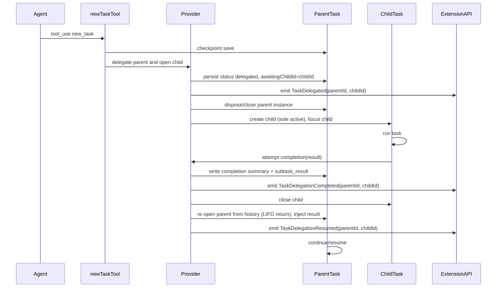

# Refactor Plan: Replace watcher-based subtasks with metadata-driven child tasks

Goal

- Eliminate parent pause-wait watcher for subtasks
- Parent should not remain open after spawning a child
- Enforce single-open-task invariant across all entry points
- Preserve rich task relationships and recovery via metadata
- Maintain UX parity or improve it without regressions

Reference baseline

- Current architecture documented in [docs/architecture/task-orchestration-new-task-tool.md](docs/architecture/task-orchestration-new-task-tool.md)
- Key code paths:
    - [ClineProvider.createTask()](src/core/webview/ClineProvider.ts:2552)
    - [Task.startSubtask()](src/core/task/Task.ts:1734)
    - [Task.waitForSubtask()](src/core/task/Task.ts:1760)
    - [Task.completeSubtask()](src/core/task/Task.ts:1772)
    - [ClineProvider.finishSubTask()](src/core/webview/ClineProvider.ts:397) // via doc section
    - [newTaskTool.ts](src/core/tools/newTaskTool.ts) // see calls around checkpoint save and spawn
    - [taskMetadata.ts](src/core/task-persistence/taskMetadata.ts:26)

Summary of change

- Today: Parent uses in-memory pause state and polling watcher [Task.waitForSubtask()](src/core/task/Task.ts:1760) while child runs. Child completion resumes parent via stack pop and [Task.completeSubtask()](src/core/task/Task.ts:1772).
- Target: On subtask spawn, immediately close and persist the parent (delegated) and open the child as the sole active task. On child completion, close the child and re-open the parent from history, inject the child’s result, and resume. Maintain LIFO semantics across opens (parent → child → parent) with a single-open-task invariant at all times.

High-level design

1. Single-open-task invariant (LIFO-preserving)

- Provider-level enforcement (at most one open task):
    - Subtask spawn: close parent, then open child (child becomes top-of-stack logically).
    - Child completion: close child, then re-open parent from history (parent becomes top).
- Applies to:
    - User-initiated start: [ClineProvider.createTask()](src/core/webview/ClineProvider.ts:2552)
    - History resume: [ClineProvider.createTaskWithHistoryItem()](src/core/webview/ClineProvider.ts:865)
    - Subtask spawn: [Task.startSubtask()](src/core/task/Task.ts:1734)
    - IPC StartNewTask: API startNewTask path in [src/extension/api.ts](src/extension/api.ts:108)
- LIFO semantics are preserved across opens (parent → child → parent), while ensuring exactly one open task instance at any moment. For non-subtask entries (e.g., user-initiated, history resume, IPC), close the current open task before opening the next.

2. new_task behavior changes

- In [newTaskTool.ts](src/core/tools/newTaskTool.ts):
    - Keep validation, approval, checkpoint save semantics (see checkpoint save near line ~119).
    - Replace subtask spawn that pauses parent with:
        - Persist parent status and relationship metadata
        - Close parent immediately
        - Create child as a fresh, top-level active task with inherited metadata linking back to parent (rootTaskId, parentTaskId)
- Parent closure:
    - Instead of setting parent.isPaused and polling, call provider to close the parent instance and clean resources:
        - Provider API to atomically:
            - Persist a ParentDelegated record into metadata store
            - Emit TaskDelegated event (new) for UI and Bridge
            - Abort and dispose the parent task instance
- Child creation:
    - Enforce single-open-task invariant, then create child via [ClineProvider.createTask()](src/core/webview/ClineProvider.ts:2552)
    - Pass initialTodos as today, inherit provider options as today

3. Metadata-driven orchestration

- Extend persisted HistoryItem and per-task metadata:
    - Add fields:
        - status: active | completed | aborted | delegated
        - delegatedToId?: string
        - childIds?: string[]
        - awaitingChildId?: string // populated during delegation
        - completedByChildId?: string // when a child completes for this parent
        - completionResultSummary?: string // short text summary written by the completer
    - Persist and update on state transitions using [taskMetadata.ts](src/core/task-persistence/taskMetadata.ts:26) and related services.
- On new_task:
    - Parent: status=delegated, awaitingChildId=childId, delegatedToId=childId, push childId into childIds[]
    - Child: parentTaskId=parentId, rootTaskId either inherited or self if none
- On child completion:
    - Rehydrate and open the parent as the active task (LIFO return)
    - Update parent metadata with:
        - status=active (re-opened from delegated)
        - completedByChildId=childId
        - completionResultSummary=text result
        - awaitingChildId cleared; ensure childId ∈ childIds[]
    - Persist a synthetic subtask_result record into the parent’s histories; the re-opened parent instance loads this on startup and then resumes processing

4. Event model adjustments

- Do not use TaskPaused/TaskUnpaused for delegation-based subtasks (no in-memory paused parent)
- Introduce/align events:
    - TaskDelegated: parent closed due to delegation (includes parentId, childId)
    - TaskDelegationResumed: parent re-opened due to child completion (includes parentId, childId)
    - TaskDelegationCompleted: child completion write-back finalized (includes parentId, childId, summary)
- Retain TaskSpawned for analytics; emit alongside TaskDelegated on spawn
- IPC and Bridge mapping:
    - Update [src/extension/api.ts](src/extension/api.ts:204) and [packages/cloud/src/bridge/ExtensionChannel.ts](packages/cloud/src/bridge/ExtensionChannel.ts:176) to forward TaskDelegated, TaskDelegationResumed, TaskDelegationCompleted
    - Update [packages/cloud/src/bridge/TaskChannel.ts](packages/cloud/src/bridge/TaskChannel.ts:45) if task-level routing needs these new event types

5. UI and UX

- Parent closure UX:
    - In the webview, add a user-visible record in the parent’s message journal before closure: Delegated to task childId
    - History list: parent shows Delegated badge and link to child
- Active view:
    - Focus the child immediately on spawn; on child completion, focus re-opens to parent automatically (LIFO return)
- History after completion:
    - Parent item becomes Active (focused) after re-open, with a subtask_result message injected
    - Child item is Closed/Completed with backlink to parent
- History browsing:
    - Selecting any item enforces single-open-task invariant (closes current, opens selected)
- No paused indicators in UI for subtask flows

6. Provider and mode handling

- Remove pausedModeSlug usage for delegation-based subtasks
- Mode switch:
    - On spawn: switch to child’s mode (see [ClineProvider.handleModeSwitch](src/core/webview/ClineProvider.ts:159))
    - On completion: when re-opening the parent from history, switch to the parent’s saved mode (from metadata/history)
- Rate limiting remains shared as documented (see Task.lastGlobalApiRequestTime around [Task.ts:228](src/core/task/Task.ts:228))

7. Message and token accounting

- Child completion injects a summary into the parent’s histories:
    - Persist a synthetic message tagged subtask_result in the parent’s UI message history and API conversation history files
    - On re-open, the parent instance loads these histories and resumes
- Token usage remains per-task; aggregation is out of scope. Metadata relationships enable later UI aggregation

8. Checkpoints

- Preserve checkpoint behavior:
    - Before delegation, save parent checkpoint (already done in [newTaskTool.ts](src/core/tools/newTaskTool.ts))
    - Child may operate with its own checkpoint service as today
- No special rollback semantics are introduced beyond existing capabilities

9. Recovery and resume flows

- Crash or extension restart:
    - If the last active task is a child and the parent has awaitingChildId, normal execution continues; on child completion the provider will re-open the parent automatically
- History resume edge cases:
    - Opening a delegated parent before the child completes shows read-only state and linkage to the child, with an Open Child action
    - After the child completes, opening the parent re-opens it as the sole active task (and closes anything else)

10. Bridge subscription

- Single-open-task invariant reduces multi-subscription complexity
- Still implement multi-pending fix in Bridge orchestrator later if desired, but it’s no longer critical for subtasks
    - See proposal in [packages/cloud/src/bridge/BridgeOrchestrator.ts](packages/cloud/src/bridge/BridgeOrchestrator.ts:160) to replace single pendingTask with pendingTasks map

11. Policy and validation

- No change to tool permission checks in [validateToolUse()](src/core/tools/validateToolUse.ts:1444)
- new_task still asks for approval
- Mode restrictions and file pattern rules unaffected

12. Backwards-compatibility and migration

- Historical tasks that were paused will continue to exist in history as-is; no live conversion required
- New flows will never create paused parents
- UI text and localization:
    - Add new strings for Delegated and Delegation completed to [src/i18n/locales/\*/common.json](src/i18n/locales/en/common.json)

13. Testing strategy

- Unit tests

    - Add tests in [src/core/tools/**tests**/newTaskTool.spec.ts](src/core/tools/__tests__/newTaskTool.spec.ts):
        - Parent closes on new_task; child becomes sole active
        - Metadata fields set: status=delegated, awaitingChildId, delegatedToId
        - Child creation inherits rootTaskId and parentTaskId
        - No calls to [Task.waitForSubtask()](src/core/task/Task.ts:1760)
    - Add tests for child completion write-back and resume:
        - Parent is re-opened (active) with completionResultSummary and completedByChildId set; awaitingChildId cleared
        - subtask_result record persisted and visible after parent re-open

- API and IPC
    - Coverage for TaskDelegated, TaskDelegationResumed, TaskDelegationCompleted propagation through [src/extension/api.ts](src/extension/api.ts:204) and cloud bridge

14. Implementation plan and tasks

- Phase 1: Data model and events

    - Extend HistoryItem and metadata schema with delegation fields in [taskMetadata.ts](src/core/task-persistence/taskMetadata.ts:26)
    - Add TaskDelegated and TaskDelegationCompleted events and wire through:
        - Provider emitter, [src/extension/api.ts](src/extension/api.ts:204), [packages/cloud/src/bridge/ExtensionChannel.ts](packages/cloud/src/bridge/ExtensionChannel.ts:176)
    - Add helpers to persist subtask_result into parent histories

- Phase 2: new_task refactor

    - In [newTaskTool.ts](src/core/tools/newTaskTool.ts):
        - After approval and checkpoint, call provider to delegate-and-open child; return success
    - In [Task.startSubtask()](src/core/task/Task.ts:1734):
        - Replace pause-and-wait with provider-level delegate-and-open call
        - Remove setting isPaused and childTaskId
        - Move TaskSpawned emission to provider when child is created (if retained)

- Phase 3: Provider orchestration

    - Add provider method delegateParentAndOpenChild that:
        - Writes parent delegation metadata
        - Emits TaskDelegated with linkage
        - Disposes parent task instance and clears stack
        - Creates child task as sole active task and focuses it
    - Enforce single-open-task invariant at all task creation entry points:
        - [ClineProvider.createTask()](src/core/webview/ClineProvider.ts:2552)
        - [ClineProvider.createTaskWithHistoryItem()](src/core/webview/ClineProvider.ts:865)
        - IPC StartNewTask in [src/extension/api.ts](src/extension/api.ts:108)

- Phase 4: Child completion write-back

    - Modify attempt completion flow in [src/core/prompts/tools/attempt-completion.ts](src/core/prompts/tools/attempt-completion.ts) to:
        - Detect parentTaskId via metadata
        - Persist completionResultSummary and subtask_result into parent histories
        - Emit TaskDelegationCompleted
        - Close child and re-open the parent (TaskDelegationResumed) as the sole active task; inject result and resume

- Phase 5: UI updates

    - Webview:
        - Remove paused UI for subtasks
        - Add delegated status indicators in history
        - Add links from parent to child and vice versa
        - Adjust mode badge logic since no restoration occurs
    - Localization: add strings for new statuses in [src/i18n](src/i18n/index.ts)

- Phase 6: Cleanup

    - Remove unused pause-wait code paths:
        - [Task.waitForSubtask()](src/core/task/Task.ts:1760) no longer used by new_task flow
        - Remove references to pausedModeSlug in subtask orchestration
        - Update logs to remove [subtasks] paused and resumed messages for new flow
    - Keep soft cancel and resume flows for general tasks as-is

- Phase 7: Tests
    - Update and add unit tests as specified
    - Ensure vitest guidance followed per repo rules
    - Verify no flakiness in single-open-task invariant under rapid operations

15. Risks and mitigations

- Risk: UI references to TaskPaused and TaskUnpaused
    - Mitigation: Audit event handlers, replace with TaskDelegated and TaskDelegationCompleted where needed
- Risk: Loss of context injection into parent on completion
    - Mitigation: Implement robust persistence of subtask_result into parent histories with defensive error logging
- Risk: Unexpected reliance on pausedModeSlug elsewhere
    - Mitigation: Search and remove or guard usage in child flow, keep for other unrelated flows if still needed
- Risk: Telemetry dashboards expecting paused events
    - Mitigation: Update telemetry mappings to handle new events

16. Rollout strategy

- Implement behind an experiment flag experiments.useMetadataSubtasks for one release
- Default to new behavior in Nightly first; collect feedback
- Remove flag and dead code after stabilization

17. Mermaid sequence for new flow

18. Acceptance criteria

- After invoking new_task, exactly one active task exists: the child
- Parent appears in history with status Delegated and link to child during child execution
- No paused indicators or polling loops are active for subtasks
- On child completion, child closes and the parent re-opens focused with the child’s result injected (LIFO return)
- All task creation paths maintain the single-open-task invariant

19. File touch list

- Core

    - [src/core/tools/newTaskTool.ts](src/core/tools/newTaskTool.ts)
    - [src/core/task/Task.ts](src/core/task/Task.ts)
    - [src/core/webview/ClineProvider.ts](src/core/webview/ClineProvider.ts)
    - [src/core/prompts/tools/attempt-completion.ts](src/core/prompts/tools/attempt-completion.ts)
    - [src/core/task-persistence/taskMetadata.ts](src/core/task-persistence/taskMetadata.ts)
    - [src/core/task-persistence/apiMessages.ts](src/core/task-persistence/apiMessages.ts)
    - [src/core/task-persistence/taskMessages.ts](src/core/task-persistence/taskMessages.ts)

- IPC and Bridge

    - [src/extension/api.ts](src/extension/api.ts)
    - [packages/cloud/src/bridge/ExtensionChannel.ts](packages/cloud/src/bridge/ExtensionChannel.ts)
    - [packages/cloud/src/bridge/TaskChannel.ts](packages/cloud/src/bridge/TaskChannel.ts)
    - Optional: [packages/cloud/src/bridge/BridgeOrchestrator.ts](packages/cloud/src/bridge/BridgeOrchestrator.ts)

- UI
    - Webview state and components to reflect delegated status
    - [src/i18n/locales/\*/common.json](src/i18n/locales/en/common.json) additions

20. Removal checklist

- Remove usage of:
    - [Task.waitForSubtask()](src/core/task/Task.ts:1760) in new_task flow
    - pausedModeSlug in subtask logic
    - TaskPaused and TaskUnpaused events for subtask flows
    - Resume parent path in [ClineProvider.finishSubTask()](src/core/webview/ClineProvider.ts:397) for subtask flows

21. Documentation updates

- Update [docs/architecture/task-orchestration-new-task-tool.md](docs/architecture/task-orchestration-new-task-tool.md) to reflect metadata-driven orchestration
- Add a section documenting new events TaskDelegated and TaskDelegationCompleted
- Clarify token and checkpoint behaviors remain unchanged

22. Provider orchestration APIs and invariants

- delegateParentAndOpenChild(params)

    - Location: [ClineProvider.delegateParentAndOpenChild()](src/core/webview/ClineProvider.ts:2552)
    - Inputs: { message, initialTodos, mode, parentId }
    - Atomic steps (single-open-task invariant):
        - Persist parent delegation metadata:
            - status=delegated
            - delegatedToId=childId
            - awaitingChildId=childId
            - push childId into childIds[] (dedupe)
        - Emit TaskDelegated(parentId, childId)
        - Close/dispose parent instance
        - Create child as sole active task:
            - Inherit rootTaskId
            - Set parentTaskId=parentId
            - Apply initialTodos
        - Switch provider mode to child’s mode via [ClineProvider.handleModeSwitch()](src/core/webview/ClineProvider.ts:159)
        - Focus child (UI + Bridge)

- reopenParentFromDelegation(params)
    - Location: [ClineProvider.reopenParentFromDelegation()](src/core/webview/ClineProvider.ts:865)
    - Inputs: { parentId, childId, completionResultSummary, injectedMessages }
    - Atomic steps (single-open-task invariant):
        - Persist parent write-backs:
            - completedByChildId=childId
            - completionResultSummary
            - clear awaitingChildId
            - status=active
        - Append synthetic subtask_result into parent histories (UI + API)
            - Helpers: [taskMessages.ts](src/core/task-persistence/taskMessages.ts:1), [apiMessages.ts](src/core/task-persistence/apiMessages.ts:1)
        - Emit TaskDelegationCompleted(parentId, childId, summary)
        - Close child instance (if still open)
        - Re-open parent from history as sole active task with focus
            - Restore parent’s saved mode (from history metadata) via [ClineProvider.handleModeSwitch()](src/core/webview/ClineProvider.ts:159)
        - Emit TaskDelegationResumed(parentId, childId)

23. attempt-completion flow updates

- Location: [prompts/tools/attempt-completion.ts](src/core/prompts/tools/attempt-completion.ts:1)
- Behavior:
    - On child’s attempt_completion (after user approval checks):
        - Call provider.reopenParentFromDelegation({ parentId, childId, completionResultSummary, injectedMessages })
        - Provider injects subtask_result into parent histories
        - Provider closes child and re-opens parent focused (LIFO return)
    - No calls to [Task.waitForSubtask()](src/core/task/Task.ts:1760) or pausedMode restoration paths

24. Metadata transitions

- On spawn:
    - Parent: status=delegated, awaitingChildId=childId, delegatedToId=childId, childIds[].push(childId)
    - Child: parentTaskId=parentId, rootTaskId inherited (or self if none)
- On child completion:
    - Parent: status=active (re-opened), completedByChildId=childId, completionResultSummary set, awaitingChildId cleared
    - Child: status=completed | aborted (as applicable)
- Crash/restart:
    - On next activation, if a delegated parent has awaitingChildId, re-open or prompt to open the child to continue; the parent re-opens only after the child completes

25. Events and IPC/Bridge mapping

- New/updated events:
    - TaskDelegated(parentId, childId)
    - TaskDelegationCompleted(parentId, childId, summary)
    - TaskDelegationResumed(parentId, childId)
- IPC/Bridge propagation:
    - Update [src/extension/api.ts](src/extension/api.ts:204) to emit the above events
    - Update [packages/cloud/src/bridge/ExtensionChannel.ts](packages/cloud/src/bridge/ExtensionChannel.ts:176) mapping to forward them
    - Update [packages/cloud/src/bridge/TaskChannel.ts](packages/cloud/src/bridge/TaskChannel.ts:45) if task-level routing needs these event types

26. Testing updates (unit)

- Unit: [src/core/tools/**tests**/newTaskTool.spec.ts](src/core/tools/__tests__/newTaskTool.spec.ts:1)
    - Parent closes on new_task; child becomes sole active
    - Metadata fields (status=delegated, awaitingChildId, delegatedToId)
    - Child inherits rootTaskId, parentTaskId
    - No calls to [Task.waitForSubtask()](src/core/task/Task.ts:1760)
    - On child completion:
        - Parent re-opens as active
        - completedByChildId set; awaitingChildId cleared
        - completionResultSummary saved
        - subtask_result visible in histories upon parent re-open
