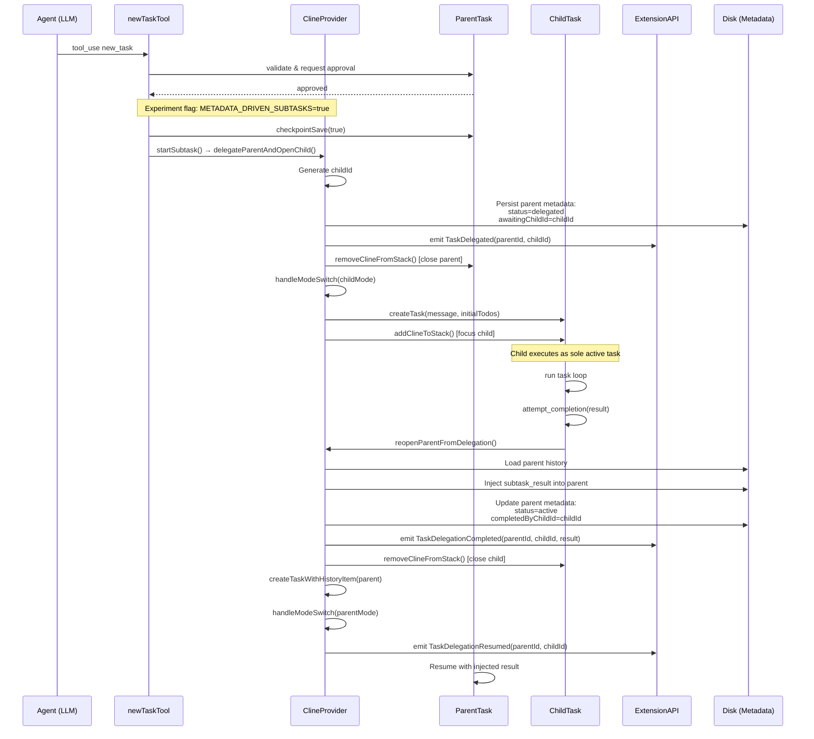
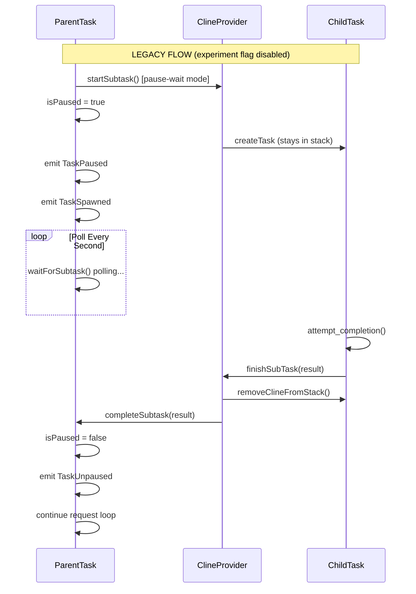

# Task Orchestration & new_task Tool Architecture

## Table of Contents

1. [Overview](#overview)
2. [new_task Tool Implementation](#new_task-tool-implementation)
3. [Task Creation & Initialization Flow](#task-creation--initialization-flow)
4. [Delegation Events](#delegation-events)
5. [Task State & Metadata](#task-state--metadata)
6. [Experiment Flag & Gating](#experiment-flag--gating)
7. [Provider Orchestration Methods](#provider-orchestration-methods)
8. [Subtask Lifecycle (Metadata-Driven)](#subtask-lifecycle-metadata-driven)
9. [Resumption & Recovery Flows](#resumption--recovery-flows)
10. [Legacy Pause/Wait Mechanism](#legacy-pausewait-mechanism)
11. [Task Relationship IDs](#task-relationship-ids)
12. [UI/UX Delegation Indicators](#uiux-delegation-indicators)
13. [Checkpoint Integration](#checkpoint-integration)
14. [Todo List Integration](#todo-list-integration)
15. [VSCode Settings](#vscode-settings)
16. [Provider Rate Limiting & Scheduling](#provider-rate-limiting--scheduling)
17. [Auto-Approval System](#auto-approval-system)
18. [Tool Repetition Detection](#tool-repetition-detection)
19. [Policy Enforcement](#policy-enforcement)
20. [Token Usage Accounting](#token-usage-accounting)
21. [Checkpoint Exclusions](#checkpoint-exclusions)
22. [Child Task Option Inheritance](#child-task-option-inheritance)
23. [File Context Scoping](#file-context-scoping)
24. [Logging & Diagnostics](#logging--diagnostics)
25. [Architecture Diagrams](#architecture-diagrams)
26. [Testing Strategy](#testing-strategy)
27. [Migration Guide](#migration-guide)

---

## Overview

The task orchestration system in Roo Code enables hierarchical task execution through subtasks, allowing complex workflows to be broken down into manageable units. The `new_task` tool is the primary mechanism for creating subtasks, with comprehensive monitoring, state management, and recovery capabilities.

### Key Concepts

**Metadata-Driven Delegation (Default)**

- **Single-Open Task**: Only one task is active at a time (single-open-task invariant)
- **Event-Driven Architecture**: Task lifecycle events propagate through EventEmitter
- **Persistent State**: Task relationships and delegation state persisted to disk
- **Delegate/Reopen Mechanism**: Parent task closes and delegates to child; child completion reopens parent
- **Mode Preservation**: Each task's mode persisted in metadata, restored on reopening

The modern metadata-driven approach (controlled by [`EXPERIMENT_IDS.METADATA_DRIVEN_SUBTASKS`](../../src/shared/experiments.ts:11)) replaces the legacy pause-wait mechanism with a cleaner delegation model:

1. **Parent Task Delegates**: When spawning a child, parent closes and writes delegation metadata
2. **Single Open Task**: Only child remains in active stack
3. **Child Writes Back**: On completion, child injects result into parent's persisted history
4. **Parent Reopens**: Parent task reopens from disk with injected result

This eliminates memory-intensive pause-wait polling and ensures robust recovery after crashes.

### Legacy Pause/Wait Mechanism

The original implementation (still available when experiment flag is disabled) uses:

- **LIFO Task Stack**: Parent-child hierarchy managed in-memory stack
- **Pause/Resume Polling**: Parent task pauses and polls while child executes
- **In-Memory State**: Parent remains in memory during child execution

See [Legacy Pause/Wait Mechanism](#legacy-pausewait-mechanism) section for details.

---

## new_task Tool Implementation

### Location

[`src/core/tools/newTaskTool.ts`](../../src/core/tools/newTaskTool.ts)

### Tool Parameters

```typescript
interface NewTaskParams {
	mode: string // Required: Target mode slug (e.g., "code", "architect")
	message: string // Required: Initial task message/instructions
	todos?: string // Optional: Markdown checklist of initial todos
}
```

### Execution Flow

```typescript
// 1. Parameter Validation
if (!mode) → error: missing 'mode' parameter
if (!message) → error: missing 'message' parameter

// 2. VSCode Setting Check
const requireTodos = vscode.workspace
  .getConfiguration(Package.name)
  .get<boolean>("newTaskRequireTodos", false)

if (requireTodos && todos === undefined) → error: missing 'todos' parameter

// 3. Parse Todos (if provided)
todoItems = parseMarkdownChecklist(todos)

// 4. Un-escape Message
// Handles hierarchical subtask escaping: \\@ -> \@
unescapedMessage = message.replace(/\\\\@/g, "\\@")

// 5. Validate Mode
targetMode = getModeBySlug(mode, customModes)
if (!targetMode) → error: invalid mode

// 6. Request User Approval
didApprove = await askApproval("tool", toolMessage)
if (!didApprove) → return

// 7. Save Checkpoint (if enabled)
if (task.enableCheckpoints) {
  task.checkpointSave(true)
}

// 8. Spawn Subtask (routes to delegation or legacy based on experiment flag)
newTask = await task.startSubtask(unescapedMessage, todoItems, mode)

// 9. Push Success Result
pushToolResult("Successfully created new task...")
```

### Error Handling

| Error Condition                 | Action                                | Telemetry                     |
| ------------------------------- | ------------------------------------- | ----------------------------- |
| Missing `mode`                  | Increment mistake count, return error | `recordToolError("new_task")` |
| Missing `message`               | Increment mistake count, return error | `recordToolError("new_task")` |
| Missing `todos` (when required) | Increment mistake count, return error | `recordToolError("new_task")` |
| Invalid todos format            | Increment mistake count, return error | `recordToolError("new_task")` |
| Invalid mode                    | Return error (no mistake count)       | None                          |
| Policy restriction              | Return localized error                | None                          |

---

## Task Creation & Initialization Flow

### Entry Points

1. **User-initiated**: [`ClineProvider.createTask()`](../../src/core/webview/ClineProvider.ts:2552)
2. **Subtask spawn (metadata-driven)**: [`ClineProvider.delegateParentAndOpenChild()`](../../src/core/webview/ClineProvider.ts:2893)
3. **History resume**: [`ClineProvider.createTaskWithHistoryItem()`](../../src/core/webview/ClineProvider.ts:865)
4. **IPC StartNewTask**: [`API.startNewTask()`](../../src/extension/api.ts:108)

### Metadata-Driven Creation Flow

```
┌─────────────────────────────────────────────────────────────┐
│ new_task Tool Invoked                                        │
└───────────────────────┬─────────────────────────────────────┘
                        │
                        ▼
┌─────────────────────────────────────────────────────────────┐
│ Task.startSubtask() - checks experiment flag               │
│ - If METADATA_DRIVEN_SUBTASKS enabled:                     │
│   → delegateParentAndOpenChild()                           │
│ - If disabled (legacy):                                     │
│   → pause-wait flow (see Legacy section)                   │
└───────────────────────┬─────────────────────────────────────┘
                        │
                        ▼
┌─────────────────────────────────────────────────────────────┐
│ ClineProvider.delegateParentAndOpenChild()                  │
│ - Generate child task ID                                    │
│ - Update parent metadata: status=delegated                  │
│ - Persist parent metadata to disk                           │
│ - Emit TaskDelegated event                                  │
│ - Close parent via removeClineFromStack()                   │
└───────────────────────┬─────────────────────────────────────┘
                        │
                        ▼
┌─────────────────────────────────────────────────────────────┐
│ ClineProvider.createTask(message, undefined, parentRef)     │
│ - Creates new Task instance with parent reference           │
│ - Sets rootTask, parentTask, taskNumber                     │
│ - Initializes todoList from initialTodos                    │
└───────────────────────┬─────────────────────────────────────┘
                        │
                        ▼
┌─────────────────────────────────────────────────────────────┐
│ ClineProvider.addClineToStack(task)                         │
│ - Pushes task to clineStack (now only 1 task)              │
│ - Emits TaskFocused event                                   │
│ - Performs preparation tasks (e.g., LMStudio model load)    │
└───────────────────────┬─────────────────────────────────────┘
                        │
                        ▼
┌─────────────────────────────────────────────────────────────┐
│ ClineProvider.handleModeSwitch(mode)                        │
│ - Updates provider mode to child's mode                     │
│ - Loads mode-specific API configuration                     │
│ - Emits ModeChanged event                                   │
└───────────────────────┬─────────────────────────────────────┘
                        │
                        ▼
┌─────────────────────────────────────────────────────────────┐
│ Task Constructor                                             │
│ - Assigns taskId (crypto.randomUUID())                      │
│ - Sets parentTaskId, rootTaskId from parent task            │
│ - Initializes mode (async via initializeTaskMode)           │
│ - Creates FileContextTracker                                │
│ - Sets up event listeners                                   │
│ - Initializes MessageQueueService                           │
│ - Sets todoList from initialTodos                           │
└───────────────────────┬─────────────────────────────────────┘
                        │
                        ▼
┌─────────────────────────────────────────────────────────────┐
│ Task.startTask(task, images)                                │
│ - Subscribes to BridgeOrchestrator (if enabled)             │
│ - Clears message histories (fresh slate)                    │
│ - Posts state to webview                                    │
│ - Adds initial task message                                 │
│ - Calls initiateTaskLoop()                                  │
└─────────────────────────────────────────────────────────────┘
```

**Key Difference from Legacy**: Parent task is completely closed and removed from stack. Only child remains active (single-open-task invariant).

### Task Constructor Parameters

```typescript
interface TaskOptions {
	provider: ClineProvider // Reference to provider
	apiConfiguration: ProviderSettings // API settings
	enableDiff?: boolean // Enable diff editing
	enableCheckpoints?: boolean // Enable checkpoints
	checkpointTimeout?: number // Checkpoint timeout (5-600s)
	enableBridge?: boolean // Enable remote control
	fuzzyMatchThreshold?: number // Diff matching threshold
	consecutiveMistakeLimit?: number // Mistake limit before asking user
	task?: string // Initial task message
	images?: string[] // Initial images
	historyItem?: HistoryItem // For resuming from history
	experiments?: Record<string, boolean> // Feature flags
	startTask?: boolean // Auto-start task (default: true)
	rootTask?: Task // Root task reference
	parentTask?: Task // Parent task reference
	taskNumber?: number // Task number in stack
	onCreated?: (task: Task) => void // Creation callback
	initialTodos?: TodoItem[] // Initial todo list
	workspacePath?: string // Workspace directory
}
```

---

## Delegation Events

### Event Definitions

**Location**: [`packages/types/src/events.ts`](../../packages/types/src/events.ts:30)

```typescript
export enum RooCodeEventName {
	// Metadata-driven subtask lifecycle
	TaskDelegated = "taskDelegated", // Parent closed, delegated to child
	TaskDelegationCompleted = "taskDelegationCompleted", // Child completed, wrote back
	TaskDelegationResumed = "taskDelegationResumed", // Parent re-opened after child

	// Legacy subtask lifecycle (see Legacy section)
	TaskPaused = "taskPaused",
	TaskUnpaused = "taskUnpaused",
	TaskSpawned = "taskSpawned",
}
```

### Event Payloads

**TaskDelegated**

```typescript
[RooCodeEventName.TaskDelegated]: z.tuple([
  z.string(),  // parentTaskId
  z.string(),  // childTaskId
])
```

**Emitted**: When parent delegates to child  
**Location**: [`ClineProvider.delegateParentAndOpenChild()`](../../src/core/webview/ClineProvider.ts:2893)

**TaskDelegationCompleted**

```typescript
[RooCodeEventName.TaskDelegationCompleted]: z.tuple([
  z.string(),  // parentTaskId
  z.string(),  // childTaskId
  z.string(),  // completionResultSummary
])
```

**Emitted**: When child completes and writes result to parent  
**Location**: [`ClineProvider.reopenParentFromDelegation()`](../../src/core/webview/ClineProvider.ts:2975)

**TaskDelegationResumed**

```typescript
[RooCodeEventName.TaskDelegationResumed]: z.tuple([
  z.string(),  // parentTaskId
  z.string(),  // childTaskId
])
```

**Emitted**: When parent task reopens after child completion  
**Location**: [`ClineProvider.reopenParentFromDelegation()`](../../src/core/webview/ClineProvider.ts:2975)

### Event Flow Architecture

```
┌──────────────────────────────────────────────────────────────┐
│ Task Instance (EventEmitter)                                 │
│ - Emits: TaskDelegated, TaskDelegationCompleted            │
│ - Emits: TaskDelegationResumed                              │
│ - Emits: TaskStarted, TaskCompleted, TaskAborted            │
└────────────────────────┬─────────────────────────────────────┘
                         │ (event propagation)
                         ▼
┌──────────────────────────────────────────────────────────────┐
│ ClineProvider (TaskProviderLike)                            │
│ - Forwards task events to provider-level listeners          │
│ - Registers listeners in taskCreationCallback               │
└────────────────────────┬─────────────────────────────────────┘
                         │
                         ├─────────────────────────────────────┐
                         │                                     │
                         ▼                                     ▼
┌────────────────────────────────┐  ┌──────────────────────────────┐
│ Extension API                  │  │ BridgeOrchestrator           │
│ (IPC-based)                    │  │ (Cloud remote control)       │
│ - Broadcasts to IPC clients    │  │ - Publishes to Socket.IO     │
│ - File logging                 │  │ - ExtensionChannel events    │
└────────────────────────────────┘  │ - TaskChannel events         │
                                     └──────────────────────────────┘
```

### Event Registration in IPC

**Location**: [`src/extension/api.ts`](../../src/extension/api.ts:267)

```typescript
task.on(RooCodeEventName.TaskDelegated, (childTaskId) => {
	this.emit(RooCodeEventName.TaskDelegated, task.taskId, childTaskId)
})

task.on(RooCodeEventName.TaskDelegationCompleted, (childTaskId, summary) => {
	this.emit(RooCodeEventName.TaskDelegationCompleted, task.taskId, childTaskId, summary)
})

task.on(RooCodeEventName.TaskDelegationResumed, () => {
	this.emit(RooCodeEventName.TaskDelegationResumed, task.taskId, task.childTaskId || "")
})
```

### Event Forwarding to Bridge

**Location**: [`packages/cloud/src/bridge/ExtensionChannel.ts`](../../packages/cloud/src/bridge/ExtensionChannel.ts:176)

```typescript
const eventMapping = [
	{ from: RooCodeEventName.TaskDelegated, to: ExtensionBridgeEventName.TaskDelegated },
	{ from: RooCodeEventName.TaskDelegationCompleted, to: ExtensionBridgeEventName.TaskDelegationCompleted },
	{ from: RooCodeEventName.TaskDelegationResumed, to: ExtensionBridgeEventName.TaskDelegationResumed },
]
```

**Tests**:

- [`src/__tests__/delegation-events.spec.ts`](../../src/__tests__/delegation-events.spec.ts) - Event emission verification
- [`src/__tests__/api-delegation-forwarding.spec.ts`](../../src/__tests__/api-delegation-forwarding.spec.ts) - IPC forwarding
- [`packages/cloud/src/bridge/__tests__/ExtensionChannel.test.ts`](../../packages/cloud/src/bridge/__tests__/ExtensionChannel.test.ts) - Bridge forwarding

---

## Task State & Metadata

### HistoryItem Delegation Fields

**Location**: [`packages/types/src/history.ts`](../../packages/types/src/history.ts:23)

```typescript
export const historyItemSchema = z.object({
	id: z.string(),
	rootTaskId: z.string().optional(),
	parentTaskId: z.string().optional(),
	// ... existing fields ...

	// Delegation metadata
	status: z.enum(["active", "completed", "aborted", "delegated"]).optional(),
	delegatedToId: z.string().optional(), // Last child this parent delegated to
	childIds: z.array(z.string()).optional(), // All children spawned by this task
	awaitingChildId: z.string().optional(), // Child currently awaited (set when delegated)
	completedByChildId: z.string().optional(), // Child that completed and resumed this parent
	completionResultSummary: z.string().optional(), // Summary from completed child
})
```

### Metadata State Transitions

```
Parent Task Metadata Transitions:

Before delegation:
  status: "active"
  delegatedToId: undefined
  awaitingChildId: undefined
  childIds: []

After delegation (parent closes):
  status: "delegated" ← DELEGATED
  delegatedToId: "child-uuid"
  awaitingChildId: "child-uuid" ← AWAITING
  childIds: ["child-uuid"]

After child completion (parent reopens):
  status: "active" ← RESUMED
  delegatedToId: "child-uuid" (preserved)
  awaitingChildId: undefined ← CLEARED
  completedByChildId: "child-uuid" ← SET
  completionResultSummary: "Result text" ← SET
  childIds: ["child-uuid"]
```

### Single-Open-Task Invariant

**Critical Property**: At any given time, exactly ONE task is in the active stack.

**Enforcement Points**:

1. [`ClineProvider.delegateParentAndOpenChild()`](../../src/core/webview/ClineProvider.ts:2893) - Closes parent before opening child
2. [`ClineProvider.reopenParentFromDelegation()`](../../src/core/webview/ClineProvider.ts:2975) - Closes child before reopening parent
3. [`ClineProvider.createTask()`](../../src/core/webview/ClineProvider.ts:2552) - Guards against multiple tasks when not subtask
4. [`ClineProvider.createTaskWithHistoryItem()`](../../src/core/webview/ClineProvider.ts:865) - Closes current before resume
5. [`API.startNewTask()`](../../src/extension/api.ts:108) - Closes all tasks before new task

**Verification**: [`src/__tests__/single-open-invariant.spec.ts`](../../src/__tests__/single-open-invariant.spec.ts)

---

## Experiment Flag & Gating

### Flag Definition

**Location**: [`src/shared/experiments.ts`](../../src/shared/experiments.ts:11)

```typescript
export const EXPERIMENT_IDS = {
	// ... existing flags ...

	// Metadata-driven subtasks
	METADATA_DRIVEN_SUBTASKS: "metadataDrivenSubtasks",
} as const satisfies Record<string, ExperimentId>

export const experimentConfigsMap: Record<ExperimentKey, ExperimentConfig> = {
	// ... existing configs ...

	// Default to disabled for gradual rollout
	METADATA_DRIVEN_SUBTASKS: { enabled: false },
}
```

### Gating Points

**1. Task.startSubtask()** - Route to delegation or legacy  
**Location**: [`src/core/task/Task.ts:1690`](../../src/core/task/Task.ts:1690)

```typescript
const useMetadataSubtasks = experiments.isEnabled(state.experiments ?? {}, EXPERIMENT_IDS.METADATA_DRIVEN_SUBTASKS)

if (useMetadataSubtasks) {
	// NEW: Metadata-driven delegation
	return await provider.delegateParentAndOpenChild({
		parentTaskId: this.taskId,
		message,
		initialTodos,
		mode,
	})
} else {
	// LEGACY: Pause-wait flow
	// ... (see Legacy section)
}
```

**2. attemptCompletionTool()** - Route completion flow  
**Location**: [`src/core/tools/attemptCompletionTool.ts`](../../src/core/tools/attemptCompletionTool.ts:98)

```typescript
if (useMetadataSubtasks) {
	// NEW: Reopen parent with result injection
	await provider.reopenParentFromDelegation({
		parentTaskId: cline.parentTask.taskId,
		childTaskId: cline.taskId,
		completionResultSummary: result,
	})
} else {
	// LEGACY: Complete subtask in-memory
	await provider.finishSubTask(result)
}
```

### preventCompletionWithOpenTodos Enforcement

**Location**: [`src/core/tools/attemptCompletionTool.ts`](../../src/core/tools/attemptCompletionTool.ts)

This setting is **enforced regardless of delegation model**:

```typescript
const preventCompletionWithOpenTodos = vscode.workspace
	.getConfiguration(Package.name)
	.get<boolean>("preventCompletionWithOpenTodos", false)

const hasIncompleteTodos = cline.todoList?.some((todo) => todo.status !== "completed")

if (preventCompletionWithOpenTodos && hasIncompleteTodos) {
	cline.consecutiveMistakeCount++
	pushToolResult(formatResponse.toolError("Cannot complete task while there are incomplete todos..."))
	return
}
```

**Tests**: [`src/__tests__/attempt-completion-todos-gate.spec.ts`](../../src/__tests__/attempt-completion-todos-gate.spec.ts)

---

## Provider Orchestration Methods

### delegateParentAndOpenChild()

**Location**: [`src/core/webview/ClineProvider.ts:2893`](../../src/core/webview/ClineProvider.ts:2893)

**Signature**:

```typescript
async delegateParentAndOpenChild(params: {
  parentTaskId: string,
  message: string,
  initialTodos: TodoItem[],
  mode: string,
}): Promise<Task>
```

**Atomic Steps**:

1. Get parent task from stack (must be current task)
2. Generate child task ID
3. Update parent metadata:
    - `status = "delegated"`
    - `delegatedToId = childId`
    - `awaitingChildId = childId`
    - Push `childId` into `childIds[]`
4. Persist parent metadata via `updateTaskHistory()`
5. Emit `TaskDelegated(parentId, childId)` event
6. Close parent instance via `removeClineFromStack()`
7. Create child as sole active task via `createTask(message, undefined, parentRef, { initialTodos })`
8. Switch provider mode to child's mode via `handleModeSwitch(mode)`
9. Focus child (automatic via `addClineToStack()`)

**Return**: Child task instance

**Tests**: [`src/__tests__/new-task-delegation.spec.ts`](../../src/__tests__/new-task-delegation.spec.ts)

### reopenParentFromDelegation()

**Location**: [`src/core/webview/ClineProvider.ts:2975`](../../src/core/webview/ClineProvider.ts:2975)

**Signature**:

```typescript
async reopenParentFromDelegation(params: {
  parentTaskId: string,
  childTaskId: string,
  completionResultSummary: string,
}): Promise<void>
```

**Atomic Steps**:

1. Get parent HistoryItem from `getTaskWithId(parentTaskId)`
2. Load parent's current messages from disk
3. Inject synthetic subtask_result into parent histories:
    - UI message: `{ say: "subtask_result", text: completionResultSummary }`
    - API message: `[new_task completed] Result: ${completionResultSummary}`
4. Update parent metadata:
    - `status = "active"`
    - `completedByChildId = childTaskId`
    - `completionResultSummary = completionResultSummary`
    - Clear `awaitingChildId`
    - Ensure `childTaskId ∈ childIds[]`
5. Persist updated metadata via `updateTaskHistory()`
6. Emit `TaskDelegationCompleted(parentId, childId, summary)` event
7. Close child instance (if still open) via `removeClineFromStack()`
8. Re-open parent from history via `createTaskWithHistoryItem(updatedHistoryItem)`
9. Restore parent's saved mode via `handleModeSwitch(parentMode)`
10. Set `skipPrevResponseIdOnce = true` for next API call continuity
11. Emit `TaskDelegationResumed(parentId, childId)` event
12. Focus parent (automatic)

**Return**: void (parent becomes active)

**Tests**: [`src/__tests__/attempt-completion-delegation.spec.ts`](../../src/__tests__/attempt-completion-delegation.spec.ts)

---

## Subtask Lifecycle (Metadata-Driven)

### 1. Delegation Phase

**Trigger**: `new_task` tool invocation (when experiment flag enabled)  
**Location**: [`ClineProvider.delegateParentAndOpenChild()`](../../src/core/webview/ClineProvider.ts:2893)

**State Changes**:

- Parent: `status = "delegated"`, metadata persisted to disk, instance disposed
- Child: Created as sole active task
- Provider mode: Switches to child's mode
- Events: `TaskDelegated(parentId, childId)` emitted

### 2. Execution Phase

**Child runs as sole active task**:

- No parent in memory or stack
- Child's message queue independent
- Child's file context tracker independent
- Parent metadata persisted, awaiting result

### 3. Completion Phase

**Trigger**: `attempt_completion` tool in child task (when experiment flag enabled)  
**Location**: [`ClineProvider.reopenParentFromDelegation()`](../../src/core/webview/ClineProvider.ts:2975)

**Orchestration Flow**:

```typescript
// In attemptCompletionTool.ts
if (cline.parentTask) {
	const didApprove = await askFinishSubTaskApproval()
	if (!didApprove) return

	const provider = cline.providerRef.deref()
	if (!provider) throw new Error("Provider reference lost")

	// Route based on experiment flag
	if (useMetadataSubtasks) {
		// NEW: Metadata-driven
		await provider.reopenParentFromDelegation({
			parentTaskId: cline.parentTask.taskId,
			childTaskId: cline.taskId,
			completionResultSummary: result,
		})
	} else {
		// LEGACY: In-memory
		await provider.finishSubTask(result)
	}
}
```

**State Changes**:

1. Parent metadata updated on disk
2. Subtask result injected into parent's persisted histories
3. Child instance disposed
4. Parent reopened from disk with injected result
5. Provider mode restored to parent's mode
6. Events: `TaskDelegationCompleted`, `TaskDelegationResumed` emitted

### Recovery After Crash

**Scenario**: Extension crashes while child is executing.

**Recovery**:

1. On restart, parent's HistoryItem has `status: "delegated"`, `awaitingChildId: "child-uuid"`
2. User can resume either parent or child from history
3. Resuming parent: Shows as "awaiting child" in UI
4. Resuming child: Continues execution; on completion, will reopen parent
5. Parent-child relationship preserved via persisted metadata

**Contrast with Legacy**: Legacy approach loses parent-child relationship in memory; parent cannot resume waiting state after crash.

---

## Resumption & Recovery Flows

### 1. Resume from History (Delegated Parent)

**Entry**: User clicks delegated parent task in history  
**Location**: [`ClineProvider.createTaskWithHistoryItem()`](../../src/core/webview/ClineProvider.ts:865)

```typescript
async createTaskWithHistoryItem(historyItem: HistoryItem) {
  await this.removeClineFromStack()  // Clear current task

  // Check delegation status
  if (historyItem.status === "delegated" && historyItem.awaitingChildId) {
    // Parent is awaiting child completion
    // UI can show "Delegated to child {awaitingChildId}" indicator
  }

  // Restore mode if saved
  if (historyItem.mode) {
    await this.updateGlobalState("mode", historyItem.mode)
    // ... restore API config
  }

  // Create task with history
  const task = new Task({
    provider: this,
    historyItem,
    // ... options
  })

  await this.addClineToStack(task)
}
```

**Tests**: [`src/__tests__/history-resume-delegation.spec.ts`](../../src/__tests__/history-resume-delegation.spec.ts)

### 2. IPC StartNewTask During Delegation

**Scenario**: External process (test, CLI) starts new task while parent is delegated.

**Location**: [`src/extension/api.ts:108`](../../src/extension/api.ts:108)

```typescript
async startNewTask({ configuration, text, images }) {
  await provider.removeClineFromStack()  // Closes current task (child)

  // Delegated parent remains in history with status="delegated"
  // New task starts independently

  const task = await provider.createTask(text, images, undefined, options, configuration)
  return task.taskId
}
```

**Consequence**: Child becomes orphaned (closed); parent remains delegated in history but will never be reopened automatically.

**Tests**: [`src/__tests__/ipc-start-new-task-during-delegation.spec.ts`](../../src/__tests__/ipc-start-new-task-during-delegation.spec.ts)

### 3. History Orphan Prevention

**Single-open-task invariant prevents orphans**:

- Only one task active at a time
- All task creation entry points close current task first
- Parent metadata persists delegation relationship
- Child completion always attempts to reopen parent

**No safeguard needed**: Unlike legacy pause-wait, metadata-driven approach cannot create multi-task stack orphans.

---

## Legacy Pause/Wait Mechanism

**Deprecated**: This mechanism is retained for backward compatibility when [`EXPERIMENT_IDS.METADATA_DRIVEN_SUBTASKS`](../../src/shared/experiments.ts:11) is disabled.

### Legacy Events (Deprecated)

```typescript
export enum RooCodeEventName {
	// Legacy subtask lifecycle (deprecated in new flows)
	TaskPaused = "taskPaused", // Parent paused, child spawned
	TaskUnpaused = "taskUnpaused", // Parent resumed, child completed
	TaskSpawned = "taskSpawned", // Child task created
}
```

**Logging**: Legacy flows use `[legacy-subtasks]` prefix in logs.

### Legacy Spawn Phase

**Location**: [`Task.waitForSubtask()`](../../src/core/task/Task.ts:1690) (deprecated note added)

```typescript
async startSubtask(message: string, initialTodos: TodoItem[], mode: string) {
  // LEGACY FLOW (when experiment flag disabled)
  const provider = this.providerRef.deref()
  const newTask = await provider.createTask(message, undefined, this, { initialTodos })

  if (newTask) {
    // Pause parent (stays in stack)
    this.isPaused = true
    this.childTaskId = newTask.taskId

    // Switch to child's mode
    await provider.handleModeSwitch(mode)
    await delay(500)  // Allow mode change to propagate

    // Emit legacy events
    this.emit(RooCodeEventName.TaskPaused, this.taskId)
    this.emit(RooCodeEventName.TaskSpawned, newTask.taskId)
  }

  return newTask
}
```

### Legacy Wait Phase

**Polling mechanism** (deprecated):

```typescript
async waitForSubtask() {
  await new Promise<void>((resolve) => {
    this.pauseInterval = setInterval(() => {
      if (!this.isPaused) {
        clearInterval(this.pauseInterval)
        this.pauseInterval = undefined
        resolve()
      }
    }, 1000) // Poll every second
  })
}

// In recursivelyMakeClineRequests()
if (this.isPaused && provider) {
  provider.log(`[legacy-subtasks] paused ${this.taskId}`)
  await this.waitForSubtask()  // Blocks here until child completes
  provider.log(`[legacy-subtasks] resumed ${this.taskId}`)

  // Restore parent's mode
  if (currentMode !== this.pausedModeSlug) {
    await provider.handleModeSwitch(this.pausedModeSlug)
    await delay(500)
  }
}
```

### Legacy Complete Phase

```typescript
async completeSubtask(lastMessage: string) {
  // Unpause parent (in-memory)
  this.isPaused = false
  this.childTaskId = undefined

  this.emit(RooCodeEventName.TaskUnpaused, this.taskId)

  // Add child's result to parent's conversation (in-memory)
  await this.say("subtask_result", lastMessage)

  await this.addToApiConversationHistory({
    role: "user",
    content: [{
      type: "text",
      text: `[new_task completed] Result: ${lastMessage}`
    }]
  })

  // Reset previous_response_id for next API call
  this.skipPrevResponseIdOnce = true
}
```

### Legacy vs Metadata-Driven Comparison

| Aspect              | Legacy (Pause/Wait)               | Metadata-Driven                                               |
| ------------------- | --------------------------------- | ------------------------------------------------------------- |
| Parent during child | In stack, `isPaused=true`         | Closed, metadata persisted                                    |
| Stack size          | 2 (parent + child)                | 1 (child only)                                                |
| Mode restoration    | Via `pausedModeSlug` in memory    | Via `historyItem.mode` from disk                              |
| Result injection    | In-memory via `completeSubtask()` | To disk via `reopenParentFromDelegation()`                    |
| Events              | TaskPaused, TaskUnpaused          | TaskDelegated, TaskDelegationCompleted, TaskDelegationResumed |
| Crash recovery      | Parent-child relationship lost    | Preserved via metadata                                        |
| Memory usage        | Both tasks in memory              | Only active task in memory                                    |
| Logs                | `[subtasks]` prefix               | No prefix (or `[delegation]`)                                 |

---

## Task Relationship IDs

### ID Types

```typescript
class Task {
	readonly taskId: string // Unique ID (crypto.randomUUID())
	readonly rootTaskId?: string // ID of root task in hierarchy
	readonly parentTaskId?: string // ID of immediate parent
	childTaskId?: string // ID of currently executing child (mutable, legacy only)

	readonly rootTask: Task | undefined // Reference to root
	readonly parentTask: Task | undefined // Reference to parent
}
```

### Relationship Tracking

| Task Type   | taskId | parentTaskId | rootTaskId | childTaskId (legacy)                    |
| ----------- | ------ | ------------ | ---------- | --------------------------------------- |
| Main Task   | uuid-1 | undefined    | undefined  | uuid-2 (when child active, legacy)      |
| 1st Subtask | uuid-2 | uuid-1       | uuid-1     | uuid-3 (when grandchild active, legacy) |
| 2nd Subtask | uuid-3 | uuid-2       | uuid-1     | undefined                               |

**Metadata-Driven**: Parent's `delegatedToId` and `awaitingChildId` in HistoryItem track child relationship, not in-memory `childTaskId`.

### ID Persistence

**Location**: [`src/core/task-persistence/taskMetadata.ts`](../../src/core/task-persistence/taskMetadata.ts:26)

```typescript
const historyItem: HistoryItem = {
	id,
	rootTaskId,
	parentTaskId,
	number: taskNumber,
	// ... other metadata

	// Delegation metadata (new)
	status,
	delegatedToId,
	childIds,
	awaitingChildId,
	completedByChildId,
	completionResultSummary,
}
```

IDs are persisted in:

- `taskHistory` global state
- Task-specific JSON files in global storage
- Used during task resumption from history

---

## UI/UX Delegation Indicators

### Delegation Status Badges

**Location**: [`webview-ui/src/components/history/TaskItem.tsx`](../../webview-ui/src/components/history/TaskItem.tsx)

**Indicators**:

- **"Delegated" badge**: Task with `status === "delegated"`
- **Child link**: Clickable link to child task via `awaitingChildId` or `delegatedToId`
- **Completion indicator**: Shows `completionResultSummary` for completed parent tasks

### i18n Strings

**Location**: [`src/i18n/locales/en/common.json`](../../src/i18n/locales/en/common.json)

```json
{
	"tasks": {
		"delegated": "Delegated to subtask",
		"delegated_to": "Delegated to task {{childId}}",
		"delegation_completed": "Subtask completed, resuming parent",
		"awaiting_child": "Awaiting child task {{childId}}"
	}
}
```

**Tests**: [`webview-ui/src/components/history/__tests__/DelegationUI.spec.tsx`](../../webview-ui/src/components/history/__tests__/DelegationUI.spec.tsx)

---

## Checkpoint Integration

### Checkpoint Save on Subtask Spawn

**Location**: [`newTaskTool.ts:119`](../../src/core/tools/newTaskTool.ts:119)

```typescript
if (task.enableCheckpoints) {
	task.checkpointSave(true) // force=true
}
```

**Purpose**:

- Creates restore point before parent delegates (or pauses in legacy)
- Enables rollback if subtask goes wrong
- Preserves parent's file state before child makes changes

**Note**: Checkpoint save occurs BEFORE delegation, regardless of delegation model.

---

## Todo List Integration

### Initial Todos in Subtasks

```typescript
// 1. new_task tool provides todos parameter
<new_task>
  <mode>code</mode>
  <message>Implement feature X</message>
  <todos>
[ ] Design API
[ ] Write tests
[ ] Implement logic
  </todos>
</new_task>

// 2. Parsed and passed to child
const todoItems = parseMarkdownChecklist(todos)
const newTask = await task.startSubtask(message, todoItems, mode)

// 3. Child task receives todos
constructor({ initialTodos, ... }) {
  if (initialTodos && initialTodos.length > 0) {
    this.todoList = initialTodos
  }
}
```

### Todo Visibility

- Webview state: `currentTaskTodos` exposed via `this.getCurrentTask()?.todoList || []`
- Cloud bridge: todos not included in ExtensionInstance payload
- Each task has independent todo list (not shared between parent/child)

---

## VSCode Settings

### Settings Affecting Task Orchestration

| Setting Key                      | Default | Purpose                                                                           |
| -------------------------------- | ------- | --------------------------------------------------------------------------------- |
| `newTaskRequireTodos`            | `false` | Require todos parameter in new_task tool                                          |
| `preventCompletionWithOpenTodos` | `false` | Block attempt_completion if todos incomplete (enforced in both delegation models) |
| `enableCheckpoints`              | `true`  | Enable checkpoint system                                                          |
| `checkpointTimeout`              | `60`    | Checkpoint timeout (5-600s)                                                       |

**Note**: `alwaysAllowSubtasks` setting does NOT auto-approve new_task; approval always required.

---

## Provider Rate Limiting & Scheduling

### Global API Request Timestamp

**Location**: [`Task.lastGlobalApiRequestTime`](../../src/core/task/Task.ts:228)

```typescript
class Task {
	private static lastGlobalApiRequestTime?: number
}
```

**Purpose**: Ensures all tasks (parent and children) respect provider-wide rate limiting.

**Note**: In metadata-driven approach, only one task active at a time, but rate limiting still applies across task switches.

---

## Auto-Approval System

**Location**: [`Task.AutoApprovalHandler`](../../src/core/task/Task.ts:229)

**Critical**: `new_task` tool is NEVER auto-approved by settings alone. User approval always requested via `askApproval("tool", ...)`.

---

## Tool Repetition Detection

**Location**: [`src/core/tools/ToolRepetitionDetector.ts`](../../src/core/tools/ToolRepetitionDetector.ts)

Prevents infinite loops by detecting consecutive identical tool calls.

**Integration with new_task**: If same new_task parameters repeated 3+ times, execution blocked and user prompted for guidance.

---

## Policy Enforcement

**Location**: [`src/core/tools/validateToolUse.ts`](../../src/core/tools/validateToolUse.ts)

Mode restrictions (e.g., architect mode can only edit `.md` files) enforced via `FileRestrictionError`.

---

## Token Usage Accounting

**Location**: [`Task.getTokenUsage()`](../../src/core/task/Task.ts:3069)

**Critical**: Token usage is **NOT aggregated** to parent tasks. Each task tracks its own usage independently.

---

## Checkpoint Exclusions

**Location**: [`src/services/checkpoints/excludes.ts`](../../src/services/checkpoints/excludes.ts)

Patterns excluded from checkpoints:

- Build artifacts: `node_modules/`, `dist/`, `build/`, etc.
- Media files: `*.jpg`, `*.png`, `*.mp4`, etc.
- Cache files: `*.cache`, `*.log`, `*.tmp`, etc.

---

## Child Task Option Inheritance

**Location**: [`ClineProvider.createTask()`](../../src/core/webview/ClineProvider.ts:2605)

Child tasks inherit from provider state:

- `apiConfiguration`, `enableDiff`, `enableCheckpoints`, `experiments`, etc.

Child-specific (not inherited):

- `task` (message), `images`, `initialTodos`

---

## File Context Scoping

**Location**: [`Task.fileContextTracker`](../../src/core/task/Task.ts:242)

Each task has isolated file context:

- Separate file watchers
- Independent tracking
- Per-task metadata

**Metadata-Driven**: Parent's file context persisted to disk; child's context independent.

---

## Logging & Diagnostics

### Log Prefixes

**Metadata-Driven**:

- No special prefix (or `[delegation]` if added)
- Example: `delegating parent abc-123 to child def-456`

**Legacy**:

- `[legacy-subtasks]` prefix
- Example: `[legacy-subtasks] paused abc-123`

### Diagnostic Traces

**Normal delegation sequence**:

```
[delegateParentAndOpenChild] parent abc-123 → child def-456
[TaskDelegated] emitted (abc-123, def-456)
[reopenParentFromDelegation] child def-456 → parent abc-123
[TaskDelegationCompleted] emitted (abc-123, def-456, result)
[TaskDelegationResumed] emitted (abc-123, def-456)
```

---

## Architecture Diagrams

### Metadata-Driven Delegation Flow



### Legacy Pause/Wait Flow (Deprecated)



### Single-Open-Task Invariant

```
Metadata-Driven Stack State:

Before delegation:
  Stack: [ParentTask]

After delegation:
  Stack: [ChildTask]  ← Only 1 task
  Disk: Parent metadata (status=delegated)

After child completion:
  Stack: [ParentTask]  ← Only 1 task
  Disk: Parent metadata (status=active, completedByChildId set)

Legacy Stack State (for comparison):

Before spawn:
  Stack: [ParentTask]

After spawn:
  Stack: [ParentTask, ChildTask]  ← 2 tasks in memory

After child completion:
  Stack: [ParentTask]
```

---

## Testing Strategy

### Unit Tests

**Delegation Flow**:

- [`src/__tests__/new-task-delegation.spec.ts`](../../src/__tests__/new-task-delegation.spec.ts) - Delegation creation
- [`src/__tests__/attempt-completion-delegation.spec.ts`](../../src/__tests__/attempt-completion-delegation.spec.ts) - Completion write-back
- [`src/__tests__/provider-delegation.spec.ts`](../../src/__tests__/provider-delegation.spec.ts) - Provider methods

**Invariants**:

- [`src/__tests__/single-open-invariant.spec.ts`](../../src/__tests__/single-open-invariant.spec.ts) - Single-open-task verification

**Events**:

- [`src/__tests__/delegation-events.spec.ts`](../../src/__tests__/delegation-events.spec.ts) - Event emission
- [`src/__tests__/api-delegation-forwarding.spec.ts`](../../src/__tests__/api-delegation-forwarding.spec.ts) - IPC forwarding
- [`packages/cloud/src/bridge/__tests__/ExtensionChannel.test.ts`](../../packages/cloud/src/bridge/__tests__/ExtensionChannel.test.ts) - Bridge forwarding

**History & Resume**:

- [`src/__tests__/history-resume-delegation.spec.ts`](../../src/__tests__/history-resume-delegation.spec.ts) - Resume delegated parent
- [`src/__tests__/ipc-start-new-task-during-delegation.spec.ts`](../../src/__tests__/ipc-start-new-task-during-delegation.spec.ts) - IPC interruption

**Settings**:

- [`src/__tests__/attempt-completion-todos-gate.spec.ts`](../../src/__tests__/attempt-completion-todos-gate.spec.ts) - preventCompletionWithOpenTodos

**UI**:

- [`webview-ui/src/components/history/__tests__/DelegationUI.spec.tsx`](../../webview-ui/src/components/history/__tests__/DelegationUI.spec.tsx) - UI indicators

### Test Execution

**From project root**:

```bash
# Backend tests (from src/ directory)
cd src && npx vitest run __tests__/new-task-delegation.spec.ts

# UI tests (from webview-ui/ directory)
cd webview-ui && npx vitest run src/components/history/__tests__/DelegationUI.spec.tsx

# Bridge tests (from packages/cloud/ directory)
cd packages/cloud && npx vitest run src/bridge/__tests__/ExtensionChannel.test.ts
```

**IMPORTANT**: Tests MUST be run from the correct workspace directory:

- Backend: `cd src` before running vitest
- UI: `cd webview-ui` before running vitest
- Cloud: `cd packages/cloud` before running vitest

Running from project root causes "vitest: command not found" errors.

---

## Migration Guide

### For Developers

**Understanding the Refactor**:

- Read the comprehensive spec: [`docs/architecture/task-orchestration-metadata-driven-subtasks-spec.md`](../../docs/architecture/task-orchestration-metadata-driven-subtasks-spec.md)
- Review test implementations to understand behavior differences
- Check experiment flag status in your build

**Testing Both Models**:

```typescript
// Enable metadata-driven in VSCode settings.json
{
  "roo-cline.experiments": {
    "metadataDrivenSubtasks": true
  }
}

// Or via code (for testing)
const state = await provider.getState()
state.experiments = { ...state.experiments, metadataDrivenSubtasks: true }
```

**Key Behavior Changes**:

1. Parent closes during child execution (check stack length)
2. Events change from TaskPaused/TaskUnpaused to TaskDelegated/TaskDelegationCompleted/TaskDelegationResumed
3. Parent metadata persists to disk, not in memory
4. Crash recovery improved (parent-child relationship preserved)

### For Mode Writers

**File Restrictions** still apply:

- Mode restrictions enforced via `validateToolUse()`
- `FileRestrictionError` thrown for disallowed files
- Works identically in both delegation models

**Mode Switching**:

- Provider mode switches on delegation (or spawn in legacy)
- Parent's mode saved in metadata (or `pausedModeSlug` in legacy)
- Mode restored on parent reopen (or resume in legacy)

### Cross-References

**Full Implementation Spec**: [`docs/architecture/task-orchestration-metadata-driven-subtasks-spec.md`](../../docs/architecture/task-orchestration-metadata-driven-subtasks-spec.md)

**Key Files Modified**:

- Events: [`packages/types/src/events.ts`](../../packages/types/src/events.ts:30)
- History: [`packages/types/src/history.ts`](../../packages/types/src/history.ts:23)
- Experiments: [`src/shared/experiments.ts`](../../src/shared/experiments.ts:11)
- Provider: [`src/core/webview/ClineProvider.ts`](../../src/core/webview/ClineProvider.ts:2893)
- Task: [`src/core/task/Task.ts`](../../src/core/task/Task.ts:1690)
- Completion: [`src/core/tools/attemptCompletionTool.ts`](../../src/core/tools/attemptCompletionTool.ts:98)

---

## Summary

The task orchestration system provides two implementations:

**Metadata-Driven Delegation (Default when enabled)**:
✅ Single-open-task invariant (only one task active)  
✅ Crash-resistant (state persisted to disk)  
✅ Lower memory footprint (parent disposed during child)  
✅ Cleaner event model (TaskDelegated/TaskDelegationCompleted/TaskDelegationResumed)  
✅ Robust recovery (parent-child relationship in metadata)

**Legacy Pause/Wait (Backward compatible)**:
✅ In-memory parent-child stack  
✅ Polling-based wait mechanism  
✅ Original events (TaskPaused/TaskUnpaused/TaskSpawned)  
✅ Both tasks in memory during execution

The architecture supports both models through feature flagging, enabling gradual migration and rollback if needed. All monitoring, event propagation, and testing infrastructure works with both models.
